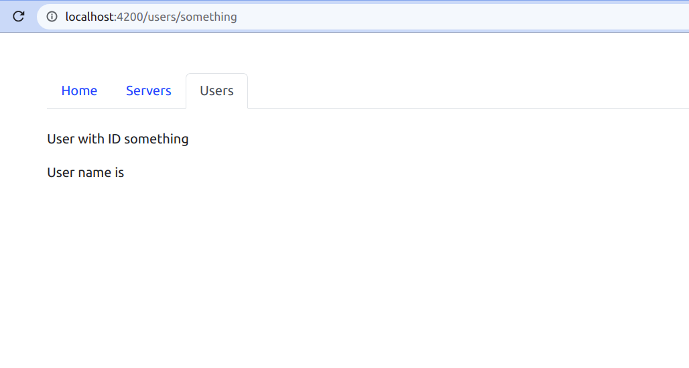

# Welcome to Angular tutorial #


Hi everyone! In this tutorial i am going to learn the angular cource from the video reference which i have got.So i prepared this document for my future reference.

 Let's leran with the video

# Section 1 : Getting statrted #

## video: 1 What is angular? ##

        Angular is the javascript frameork which allows us to build reactive single page applications[SPA].

        SPA --> Single Page Application.
            --> It is the application inwhich we only contain one HTML and bunches of javascript file
                used to navigate among may pages without generating new html pages.
            --> It increases User experience.
            --> It is fast.
            --> To identify the SPA , refresh icon will not work when we navigate to other pages in this
                Single Page  Application.

## Video : 2 Angular Versions ##
     
<center></center>
      

* First AngularJS is created  But it contains many disadvantages ( So it is omitted )

* And later Angular2 is rewritted.It is completely different from angularJS. ( Wirks well)

* Later lot of angular versions came to play with slight changes in small,increamental,compatiable 
  changes in library files.After that , every six months , angular was updated with this small changes.But
  nothing to worry about the versions , we can even program easily eith any version of angular as the coding
  most likely similar to all.

<center></center>

## Video : 3 Project setup ##

### PreRequests for angular projects ###

* Nodejs --> It is used to bundle and optimize(Rearrange) the project.

* npm    --> It is Node Package Manager.
         --> It is used to manage different dependencies(particular order that must be followed to a process).
        
### Commands to check the node and npm versions in your device ###  

```javascript
node -v
```
* Sample Output may look like below:

```javascript
npm -v
```


<b style="color:red"> NOTE : Install the node and npm in device to process the angular </b>

## Step by Step procedures to start a angular project ##

### Step : 1 Install angular cli by followinf command in terminal. ###

```javascript
npm install -g @angular/cli
```
OR

```javascript
npm install -g @angular/cli@latest
```
### Step : 2  To check angular version. ###

```javascript
ng version
```
* The sample screen may look like below:


### Step : 3 Go to the directory to create a project ###

### Step : 4 Command to generate the new project ###

```javascript
ng new project_name
```
* It will ask for strictness , routing initially give NO to them.
* Just choose the styles which you want.

* Sample Screen when project has been generated in your machine.


### Step : 5 Verify wheather it is successfully installed or not ###

### Step : 6 Go to the project directory by below command ###

```javascript
cd project_name
```
### Step : 7 To serve the application in local host ###

```javascript
ng serve
```
OR

```javascript
ng serve -o
```
OR

```javascript
ng s -o
```


 * Output screen in localhost:4200 :

 

# Video : 5 Editing the first-app #

Before going to develope an application , we must aware of the installed files when we generated the new project using angular cli.


Let's have look on important files in the project and work on it.

* package.JSON file --> It contains every dependencies and dev-dependencies of our project.

* e2e --> It is end to end testing (Need Not to worry about it).     

* node_modules --> It contains all the dependencies that package.JSON have.

* src file --> It contains the bunch of our configurartions (Need Not to worry about it). 

* app file  --> Inside the src , app folder contains the five files as 

   * app.component.html --> It contains the page.

   * app.component.css  --> Style the html.

   * app.component.TS  --> It helps to interact with html for delevering data.

   * app.component.specs.ts --> It is for testing (It is not required).

* app.component.TS --> It is most important file in the application.It contains the app-root selector which is 
                       part of index.html.

                   --> We can add multiple components using the app.component.TS to link many html pages.

* Index.html   --> It is the root file of our application.It only first geneartes the 
                   application. We can see it in INSPECT (browser dev tools)        

                              

## EX : ##

## Simple editing with html and ts file with input field  ##

* Let's have a input field with simple type="text" and a para text.

* Then we should make it dynamicly change the content of the paragraph according to the input.

* We can achieve this by using the [(ngModule)]="variable_name" in angular.

### ngModel directive ###

* It is tool of angular FormsModule or directive which is used to store anything that type in the input field in  the provided variable name.

* The ngmodel directive binds the value of HTML controls (input, select, textarea) to application data. 

### Syntax ###

```javascript
[(ngModel)]="variable_name"
```
* It uses two way binding and we can learn what they are in further video.

### Requirements to use ngModel ###

* To utilize the ngModel directive , We must import the FormsModule from library in app.module.ts file.

* app.component.html
```javascript
<input type="text" [(ngModel)]="title">
<p > {{ title }} </p>
```

* app.component.ts
```javascript
import { Component } from '@angular/core';

@Component({
  selector: 'app-root',
  templateUrl: './app.component.html',
  styleUrls: ['./app.component.css']
})
export class AppComponent {
  title = 'vijay';
}

```

* app.module.ts
```javascript
import { NgModule } from '@angular/core';
import { BrowserModule } from '@angular/platform-browser';
import { FormsModule } from '@angular/forms';
import { AppComponent } from './app.component';

@NgModule({
  declarations: [
    AppComponent
  ],
  imports: [
    BrowserModule,
    FormsModule
  ],
  providers: [],
  bootstrap: [AppComponent]
})
export class AppModule { }

```

* Otherwise , It will show error.

### Here you can see the output ###
<video controls>
 <source src="videos/ngModel-output.webm" type="video/webm">
</video>

## video : 6 Type Script ##

* TypeScript is the another type of javascript which allows to define types of variables.

* Angular code should be wriiten in typescript.

* To learn angular , we don't want to learn typescript it will be understandable.

* Typescript does not run in browser , So it is converted to javascript and it is carried out by angular cli.
  And this process is very fast.

## video : 7 A project setup to add bootstrap styling ##

### Step : 1 Install the bootsrap file in project (locally) by following command ###

* Go to the project directory (make sure that you are in correct project directory) and type below command.

```javascript
npm install --save bootstrap
```
* Below is the Output Screen :


### <div style="color:red">NOTE : It wll install the bootstrap file in the node_modules folder of our application </div> ###

### Step : 2 Configure the new file in the angular.JSON file in application ###

* First of all , we have successfully installed the bootstrap styling file in our application.

* We can find it in node_modules -> bootstrap -> dist -> css -> bootstrap.min.css

* To use the imported file , we need to configure the file in angular.JSON file as below styles to overcome older style ( Append the imported in top )


### Step : 3 Rerun the server to bundle the package ###

* Save angular.json and other files and again use ng serve command to rerun .

### Step : 4 Verify the availability of bootstrap in browser ###

* Go to the localHost in the browser and check in the inspecrt page sources wheather the style.css contains the bootsrap vetrsion . If it is , everythiong worked  fine .


## video : 8 Angular app get loading and starting ##

* Atfirst , every angular application is getting started with the main.ts file . In main.ts file , The app.module.ts file is connected by the bootstrap.

```javascript

platformBrowserDynamic().bootstrapModule(AppModule)
  .catch(err => console.error(err));

```

* It will go for app.module.ts file. In app.module.ts file , it has been provided to the components

```javascript
@NgModule({
  declarations: [
    AppComponent
  ],
  imports: [
    BrowserModule
  ],
  providers: [],
  bootstrap: [AppComponent]
```
* In will visit the app.component.ts file for the first ,  It will have the selector to 'app-root' and templateurl as 'app.component.html'.The app.componen.html is the screen we see in browser contents.

```javascript

@Component({
  selector: 'app-root',
  templateUrl: './app.component.html',
  styleUrls: ['./app.component.css']
})

```
* Then the selector was called in index.html as <app-root></app-root> in the body.

```javascript
<!doctype html>
<html lang="en">
<head>
  <meta charset="utf-8">
  <title>MyFirstApp</title>
  <base href="/">
  <meta name="viewport" content="width=device-width, initial-scale=1">
  <link rel="icon" type="image/x-icon" href="favicon.ico">
</head>
<body>
  <app-root></app-root>
</body>
</html>

```

* This is the HTML page that we could see in the browser developement tool (inspect).

* NOTE: It will also contains the javascript bundles run the angular application.


# Section : 2 The Basics  #

## Video : 1 Components ##

* Components are the key feature of angular (i.e) We can build our whole application with multiple components.

* Each component will have it's own :
    
    * HTML file.
    * Styles file.
    * Ts file ( Contains its own business logic ).

* Componets are reusable ( Design , Styles , logics ).

* It is is used to splinting up into many parts of our complete application.

## Video : 2 Creating new componets mannually ##

### app component ###

* Before going to other components we must aware about appComponet which is root component.

* appComponents will also have html.styles,specs and ts file with that.

* The speciality is , the appComponent is one which has been provided in the bootstrap[] in app.module.ts which reprents that the app component is the one holds project.


* We don't want to add other components in index.html.

* We just need other components in the app.components.html itself.

* The only selector which is added in the index.html is appComponent as below :


### Very basic component features ###

* When we say component , the .ts file is the building block . So the xxx.component.ts is the first thing , we should concern.

* We have to do all operations in the app folder . SO we must create our compinents inside the app folder with ifferent names .

* As we are going to understand only the simple features in components , we can create an seperate folder inside the app folder .

* In the Demo component , we should create an file with extension .TS with proper naming.

* Every component.ts file must contatin the following data 

```javascript

import { Component } from "@angular/core";

@Component({
 selector : 'app-demo',
 template : './demp.component.html'
}
)


export class DemoComponent{

}

```

* 1) --> class

     --> class is the maditory field in an component throughwhich the functionality of an component is decided ( business logic )

     --> We must export the class with export keyword before that , inorder to import it anyother file or component.

     --> class name should be meaningfull , first part should contain name and second part should 
         contatin description.

           Demo is the name and Component is the description.  ( DemoComponent ) .

* 2 ) --> Decorator 
 
      --> Decorator is the typescript feature which enhances the class or other elements .

      --> Decorator always starts with @ symbol.

      --> Decorator need to configured by passing javascript objects to it. Here are the most basic two configurartions.

        1 ) --> Selector 

            --> selector should be in staring .

            --> It contains the name to utilize the component in another component .

            --> The selector name should be unique.

        2 ) -->  Templateurl 

            --> This is the reference to the another file which contains the template html of our .ts file.

            --> This html file must be created with the same folder with .html extension.

* 3 ) --> import component .

      --> To use the component decorator , we must import it from angular/core library file.


## Video : 3 Understanding the role of appModueles ##

* app.module is the very important to any angular project which is like the parent of a family.

## Modules ##

* Modules are used to bundles the different spieces( components ) of any application into packeges.

## Very basic things in module ##


* Here , we can identify the following features in module.

* 1 ) --> An empty typescript class with export ( Same as Component )

* 2 ) --> Decorator : 

      --> Module decorator consists of @NgModule keyword in the beginning and it must be imported from 
          angular/core library file.

      --> Specially app.module.ts contains four basic properties and values as it's javascript object format 
          similar to component.

* 3 ) --> Decorator partitions :

      --> 1) bootstrap :

          --> It is responsible for angular to execute the first component when the app get started which
              is appcomponent.    

      --> 2 ) Declarations : 

          --> In declarations section , we must add the compoents that we created.

          --> The angular does not know the existance of component . So we need to update the every
              components presence in module.ts to get results.

          --> Once we added the component in declaration , it will ask to import the component from the 
              specified  path we should import it.

      --> 3 ) imports :

          --> Imports section allow us to import the other modules.

       --> 4 ) providers :

          --> It is used for services.

* Adding the democomponet in app.module.ts to make it use in project: 


## video 4 : Using custom component ##

* We can create custom components according to our need . 

* Component can be also updated in the app.module.ts file.

* But , we can not see it in the bowser.

* For example : I have created a component named demo with simple .ts and .html which contains only simple text.

* .html


* .ts 


* Also i attached the component in app.module.ts succssfully as below:


* But , we can't see this in browser . As we know , the angular flow will be start from index.html . In index.html ,
only the root ( app module ) is connected .

* In the app.component.html only contains the simple text . To link our new custom component in app , we must add our new component in app.component.html as an element.

* To do so , we should use the selector of our custom component and utilize it in app.component.html as weee require.

* For Example , I have used the selector of demoComponent in app.component.html as this.

* app.component.html:

```javascript

<h1>Hi i am vijay's app componet</h1>
<app-demo></app-demo>

```

* democomponent.ts

```javascript

import { Component } from "@angular/core";

@Component({
 selector : 'app-demo',
 templateUrl : 'demo.component.html'
}
)


export class DemoComponent{

}

```
* Output :

* Before using selctor as element in app.component.html:
<br>


* After using selector as element in app.component.html :


## Video : 5 Creating component with cli and nesting components ##

* We can create components with angular cli command :

```javascript

ng generate component component-name

```
* The shortcut of this command is :

```javascript

ng g c component-name

```

* These angular/cli command create a new folder in app folder with the 1 .html ,1 .style ,1 .spec and 1 .ts file with basic templates.

* We need to update the existence of new component in app.module.ts


## Nesting component ##

* Nesting means , using one component within other using the selector as element in the .html.

* Angular allows repeat the components in same or different components .

* app.component.html :

```javascript
<h1>Hi i am vijay's app componet</h1>
<app-demo></app-demo>
<app-cli-component></app-cli-component>
```

* cli.component.html : 

```javascript

<p>I am cli-component </p>
<app-demo></app-demo>

```

## video : 6 Working with component Templates ##

* A component contains not only three properies such as selector ,TemplateUrl and Stylesurl but these are all the basics,

* Template is one of the most significant component decorartor property which allows internal html elements instaed connects the different .html file .

* template is used to do inline template if it very simple . It is string type .

* If code exists single element then we can use  ` ` { Back tick } symbol to denote the string as we do javascript.

```javascript

@Component({
 selector : 'app-demo',
 template : '<app-cli-component></app-cli-component>'  //here it is not link . it is used as element 
}
)

```


```javascript
@Component({
 selector : 'app-demo',
 template : 
 `<app-cli-component></app-cli-component>   
 <app-cli-component></app-cli-component>`    //multiple lines
}
)
```
```javascript

@Component({
 selector : 'app-demo',
 template : 
`<h1> Hello everyone in ...<h1>`
}
)
```
## Video : 7 Working with component styles ##

* styles is the another inportant component decorator which helps to inline styling ,

* It is basically an array . So that we can add more than one style or inline styles .

* In array , we should declare the ` ` { Back tick } to get results .

* It is just inline styling nothing different .

* It is slight differnt from styleUrl . styleUrl requires the seperate stylesheets to style but it is inline styling.
  But , both are array format.

```javascript

@Component({
  selector: 'app-root',
  templateUrl: './app.component.html',
  // styleUrls: ['./app.component.css'],
  styles : [
`
.h1{
  color:blue;       
}
`                 //  Using inlie styles
]
})

```

## Video : 8 Full understanding of component selector ##

* selector is the main component decorator property to understand .

* It is the source to connect the components .

* Basically , a selector acts like CSS selector which only uses the element name to style .

### Normal method ###

app.component.html

```javascript
<div class="container">
    <div class="row">
     <div class="clo-xs-12">
        <h1 class="h1">Hi i am vijay's app componet</h1>
        <hr>
        <app-demo></app-demo>     <!-- It is look like an HTML element -->
        <app-cli-component></app-cli-component> 
     </div>
    </div>
</div>
```

demo.component.ts file :

```javascript
import { Component } from "@angular/core";

@Component({
 selector : 'app-demo',   // Here we selected the element by it's name as we do in CSS
 templateUrl : 'demo.component.html'
}
)


export class DemoComponent{

}
```

### Attribute method  ###

* We can also use other method to utilize this selector which means attribute selector as follows :

* app.component.html :

```javascript
<div class="container">
    <div class="row">
     <div class="clo-xs-12">
        <h1 class="h1">Hi i am vijay's app componet</h1>
        <hr>
        <app-demo></app-demo>     <!-- It is look like an HTML element -->
        <div app-cli></div>      <!-- We can select it by attribute name in .ts file -->
      </div>
    </div>
</div>
```

* Using the attribute name in .ts file with [] notation :

```javascript
import { Component, OnInit } from '@angular/core';

@Component({
  // selector: 'app-cli-component',
  selector : '[app-cli]',     // Using the attribute name as selector by [] notation
  templateUrl: './cli-component.component.html',
  styleUrls: ['./cli-component.component.css']
})
export class CliComponentComponent implements OnInit {

  constructor() { }

  ngOnInit(): void {
  }

}
```

### class method ###

* We can also use the notation in .ts file as selector by using the element with class.

* app.component.html file :

```javascript
<div class="container">
    <div class="row">
     <div class="clo-xs-12">
        <h1 class="h1">Hi i am vijay's app componet</h1>
        <hr>
        <app-demo></app-demo>     <!-- It is look like an HTML element -->
        <div app-cli></div>      <!-- We can select it by attribute name in .ts file -->
        <div class="app-cli"><div>  <!-- We can select by the class name in .ts file -->
      </div>
    </div>
</div>
```

* .ts file :

```javascript
import { Component, OnInit } from '@angular/core';

@Component({
  // selector: 'app-cli-component',
  // selector : '[app-cli]',     // Using the attribute name as selector by [] notation
  selector : '.app-cli',     // Using the class name with . notation .
  templateUrl: './cli-component.component.html',
  styleUrls: ['./cli-component.component.css']
})
export class CliComponentComponent implements OnInit {

  constructor() { }

  ngOnInit(): void {
  }

}
```

### NOTE ###

* We cannot access selectors with id .

* We cannot access the selectors by pseudo selectors like :hover or etc .

## Video : 9 Data Binding ##

* Data-Binding is the communication between the Typescript code ( Business Logic ) and the Template ( HTML ) in a component.

* The template is only visible to user ( HTML ) . Inorder to show the data dynamically , data-binding came to play to connect the typescript and template ( HTML ).

* There are some type of data-bindings available as below :

### One way Data-binding ###


### Two-way Data-binding ###


## Video : 10 String Interpolation ##

* String interpolation is the simple data-binding which is used to pass the data dynamically from typescript to template ( HTML ).

* In string interpolation , all data are converted to strinng in the end .

* It uses the syntax <b style="color:blue">  {{ Typescript variable name OR Property name  }} </b>

* We cannot use the multiline expressions in the {{ }} syntax .

## Example : ##

* .html file :

```javascript
<h3> Data Binding </h3>

<h4> String interpolation </h4>

<p> I am going to explain data-binding type : {{ type }} which is {{ name }} </p>

<p> {{ getStringInterpolation() }}</p>
```

* .ts file :

```javascript
import { Component, OnInit } from '@angular/core';

@Component({
  selector: 'app-data-binding',
  templateUrl: './data-binding.component.html',
  styleUrls: ['./data-binding.component.css']
})
export class DataBindingComponent implements OnInit {
  type: number = 1;
  name: string = "string interpolation";

  getStringInterpolation(){
    return "I am the string interpolation method who binds the method to html template from typescript";
  }
constructor() { }

  ngOnInit(): void {}

}

```

* OUTPUT:


## Video : 11 Property Binding ##

* Property binding is used to connect the attributes of an HTML element to the typescript file ( .TS file ).

* The property-binding method changes the DOM { Document Object Model } of the specified html element.

* We can bind the attributes of our html element by with the following syntax :

* <b> [ Varible or name property name to bind ]   </b>

## Example : ##

* Now , we take a button element with the attribute disabled earlier.

* Inorder to change the disabled  attribute with dynamic data from typescript , we must bind the attribute with [] symbol.

* So , We can change the disabled attribute variale value to "true" to make it enable with typescript .

* .html ( disabled property is binded with the variable status )

```javascript
<button
 class="btn btn-success"
 [disabled]="status"  
> Disable me </button>
```
* .ts file ( Here we set variable true initially to keep it disable . After 1000 milliseconds we make the variabke to false to enable)

```javascript
import { Component, OnInit } from '@angular/core';

@Component({
  selector: 'app-data-binding',
  templateUrl: './data-binding.component.html',
  styleUrls: ['./data-binding.component.css']
})
export class DataBindingComponent implements OnInit {
  type: number = 1;
  name: string = "string interpolation";
  status: boolean =true; 

  getStringInterpolation(){
    return "I am the string interpolation method who binds the method to html template from typescript";
  }
constructor() { 
  setTimeout(()=>{
     this.status=false;
  },1000)
}

  ngOnInit(): void {}

}
```

## Video : 12 Property binding VS String interpolation ##

* When we want to output somethong dynamically from template we must use "String-interpolation" and If we want to change the DOM content of an element , we must go for "Property binding".

* But , We cannot use both the property-binding and string-interpolation together.

## Video : 13 Event binding ##

* Event binding is the process of adding some functionalities to the HTML elements when certain events occured as click,mouseover , onkeypress , etc.

* These events shoul be binded with the HTMl element by  <b style="color:blue"> ( event name ) = " method name () "  </b>

* The method we assigned is need to be described the functionality to a event occured in the template elements in Typescript file.

## Example : ##

* Let us assign a button to a click event with some method which can change the button color text .

* .HTML file :

```javascript

<button 
class="btn btn-warning"
(click)="changeColor()"
>
Button 
</button>
<p> My color is {{ color }} </p>
```

.Ts file :

```javascript
  color:string ="red";

  changeColor(){
    this.color="blue";
   }

```
## VIdeo : 14 Passing and using Data with Event binding ( $event ) ##

* Event binding is very important in binding . In this we can get the information on several events with the help of $event.

* By passing the $event as as argument to event in HTML . We can get the possible events available by console it in the method.

* After that we can choose our event according to our need .


## Example : ##

* We can take the values to display in the paragraph from the events .

* Let us write the event like below:

```javascript
  para :string ='';
onShow( event : any ){
   this.para = (<HTMLInputElement>event.target).value;   // To access the correct value from the DOM.
}
```
* We can bind the event with the HTML like below :

```javascript
<input
type="text"
class="form-control"
(input)="onShow($event)"
/>
<p> {{ para }}</p>
```


## Video : 15 Two-way databinding ##

* Two-way data binding is the process of binding the value from both ends with the help of directives.

* We must use the ([ ])=" property name " --> to two way binding.

* It is simply like getting data from user and stores in a variable and utilize it for furthuer references.

* ngModel --> The one of the most frequently used directive in formsModule.

* We should have imported the FormsModule from angular form in the imports section and app.module.ts file.

* .html 

``Javascript
<input 
type="text"
class="form-control"
[(ngModel)]="content"
/>

<p>{{ content }}</p>
```

* .ts file :

```javascript
content ='vijay';
```

## Video : 16 Combining all forms of data-binding ##

* Here we can set an assignment to us .

* We must create an input field and a button.

* By clicking button the value which is obtained from the input filed must be displayed and the button must be enable only a 2 seconds when the page gets loaded.

## Video : 17 Directives ##

* Directives are Instructions in the DOM ( Document Object Model ).

* EXAMPLE :

  * components --> Components are also directives with templates which tells the component to locate in particular place .

* ngIF and more and more...

## Video : 18 Using ngIf to output data conditionally ##

* *ngIf is the directive which acts like a normal if class .

* It is structural directive which structures the DOM .

* It should be used in elements attribute with an expression / variable / method that should return either true or false.

* According to the value it determines wheather the element need to be displayed or not.

* For example , ` <p *ngIf="false"> It will not show </p> `

## Video : 19 Enhancing ngIf with an else condition ##

* The else condition can be implemented if the value returns false in the angular element attribute.

* To achieve this , we could make use of locators in html <ng-template> < #locatorName ></> </ng-template>

* This portion will be displayed if the given condition is not satisfied.

```javascript

<p> Your name is :<span *ngIf="select; else notClicked"> {{ yourName }}     </span>
</p>

<ng-template #notClicked>
<p>Button is not clicked </p>
</ng-template>
```

```javascript
import { Component, OnInit } from '@angular/core';

@Component({
  selector: 'app-directives',
  templateUrl: './directives.component.html',
  styleUrls: ['./directives.component.css']
})
export class DirectivesComponent implements OnInit {

  yourName:String='';
  select=false;

  display(){
    this.select=true;
  }

  constructor() { }

  ngOnInit(): void {
   
    
  }

}

```

## Video : 20 Styling elements dynamically with ngStyle ##

* ngStyle --> It is not the structural directives like ngIf . It is an attribute directive which only changes the element's position. It will not control the element's presence like structural directives.

* we should use the directive in an element with property binding to configure the styling .

* It dynamically updates the style.

```javascript
 <p [ngStyle]="{ background-color : black ;}">  </p> OR

 <p  [ngStyle]="{backgroundColor : 'black' }"></p>  OR

 <p [ngStyle]="getcolor()"></p> 

 ``` 

## Video : 21 Applying CSS classes dynamically with ngClass ##

* ngClass allows us to create or remove styles dynamically .

* It is also acts like a ngIf , if the certain condition is true only , the style will be applied otherwise the style will not apply to elemnt.

```javascript

* <h1 [ngClass]="{ className : variable === true OR condition }"></h1>

```


## Video : 22 Outputting lists with ngFor ##

* The syntax is *ngFor="let variable_name of array_name"

* For example ,

```javascript
 <p *ngFor="let name of names">jchgsdty</p>

```

* The array will be in typesscript file .

## Video : 23 Getting the index when using ngFor ##

* We can identify the index value in for loop.

* Syntax:

```javascript

 <div *ngFor="let variable_name of array_name ; let index_variable_name = index" >
....
</div>

```

* We can control the each items with the index value.

## Notes while making application ## 

## Model ##

* Model is just a typescript file.
 
* There is no decorartor for model.

* It is used to collect the data and store it as blueprint for later use in another component( app.component.ts ) .


## Debugging Code ##

* Read error message carefully.

* If the error is not shown and something is not working then , there is a possibility of logical error.
  To get rid of this , we can go for dev-tools in browser.In the sources part we can run our application 
  with beakponit where we are able to identify the mistake we had done.

* Augury angular - Install this tool from browser to get better understanding of our angular project with   
  graphical illustration . 


# Section 5 : Understanding component interaction and data Bindiing #

## @Input() decorator ##

* @Input() decorator is used to bind the the property/variable of one component in any component which requires the 
   property or value.

* It must be imported from angular/core library file.

## @Input(' ... ') ##

* We can also pass name as an argument which we want to use in anothercomponent.

* If we pass a name in @Input() decorator in one component , we can utilize it the name to binding it
  in other component.

## Local references ##

* Local references are very useful and easy to get value from the element and connect to typescript especially
  in input field.

* We can use it in any elements .

* But it is only accessable in template(HTML) . If we want to access it in typescript file , we need to pass his
  an argument in any method.

* Otherwise , we can access the elements properties with ViewChild method in typescript directly.

* We can access all properties attached with the element in typescript .


##  ng-content ##

* This is an atribute which is used to connect two components while parent component needs to add extra content with open and closing tag of it.If So , we need to provide the  

```javascript 
<ng-content></ng-content> 
```

in child component.


# Component life cycle hooks #

* Every angular component contains phases of executing the component when it is initiated . 

* The life-cycle hooks decides the order of phase that means which method is executable first and next and so on.

* By implementing the life cycle hook methods in our component will help us to control the flow of our component.

* The very important life-cycle methods are listed below:

  * ngOnChanges           --> Called after a bound input property changes.

  * ngOnInit              --> Called when the compoennt in initialized,

  * ngDoCheck             --> Called during every change detection run.

  * ngAfterContentInit    -->  Called after content (ng0-content) has been projected into views.

  * ngAfterContentChecked --> Called everytime the projected content has been checked.

  * ngAfterViewInit       -->  Called after the componen's view ( and child views )  has been initialized.

  * ngafterViewChecked    --> Called everytime the view ( and child view ) has been checked.

  * ngOnDestroy           --> Called once the component is about to be destroyed.

# Attribute and Structural Directives #

## Attribute Directive ##

* Looking like a normal HTML attribute ( Possibly with databinding or eventBinding ).

* Only change/affect the element that they are added to.


## Structural Directive ##

* Looklike a normal HTML attribute but have a leading *(desugauring / principally )

* Affects whole area in the DOM ( Elements get added/removed ).

## Use Attribute directive from outside of template ##

* We can create a seperate typescript file with extension called directive.ts or we can generate through the angular cli by below command :

```javascript

ng g d directive-name

```
* We can access the DOM elements by binding the selector of this typescript with any DOM element which we want to access.

* This element shoul be obtained with Elementref datatype in directive and functionality is also implemented in directive .

```javascript
import { Directive , ElementRef, OnInit } from "@angular/core";

@Directive({
    selector:'[appBasicHighlight]',
})

export class BasicHighlightDirective implements OnInit{
    constructor( private elementref : ElementRef){

    }

    ngOnInit(){
        this.elementref.nativeElement.style.backgroundColor='Orange';
        this.elementref.nativeElement.style.fontSize="30px";
    }

}
```

* We can simply bind the selector with DOM element like below:

```javascript
      <p appBasicHighlight> HERE is the para which is done with directive </p>

```

## Renderer directive  ##

* renderer directive method is merely similar to  above method.

* But , renderer method is considered to be better than that because it helps to access the DOM elements even in the services where we are unable to get the DOM elements connecton directly.

```javascript
import { Directive, ElementRef, OnInit, Renderer2 } from '@angular/core';

@Directive({
  selector: '[appRenderHighligh]'
})
export class RenderHighlighDirective implements OnInit {

  constructor(private elementRef:ElementRef,private renderer:Renderer2) { }

  ngOnInit(){
  this.renderer.setStyle(this.elementRef.nativeElement,'backgroundColor','green');
  this.renderer.setStyle(this.elementRef.nativeElement,'fontSize','50px');

  }

}
```
* We can simply bind the selector with DOM element like below:

```javascript
           <p appRenderHighligh>It is a  para which uses the renderer directive </p>

```

## HostListener events ##

* @HostListener is the imporatne decorator from angular/core library which is used to control several events in directive .

* We can use this to add some functionality to our DOM element.

```javascript

    @HostListener('mouseenter') moouse(){
   this.elementref.nativeElement.style.color="yellow";
    }
```
* There are many library events availabe in HostListener , we mostly use "click" , "mouseenter" , "mouseleave"

## @HostBinding events ##

* HostBinding is another decorator which simplifies the DOM access even more easier like below:

```javascript
  @HostBinding('style.backgroundColor') backgroundColor:string='green';

  @HostListener('mouseenter') mouseenter(){
    this.elementRef.nativeElement.style.backgroundColor='blue';
    this.elementRef.nativeElement.style.fontSize='40px'
  }
  @HostListener('mouseleave') mouseleave(){
    this.elementRef.nativeElement.style.backgroundColor='green';
    this.elementRef.nativeElement.style.fontSize='25px'

  }
```
# Services #

* Services are centralizd code or class that helps to duplication of code and Data storage among the components.

* It is basically a Normal Typescript Class which contaiins methods or data incommon for all components.

## Using services in different ways : ##

* We can make use of services class in differnet ways :

  * 1 --> Creating Instances .

  * 2 --> Hierarchial Injector .

### Creating Instance method  ###  

* We can make use of the class by simply creating instance in the required components as below : 

* Servicefile:

```javascript

export class LoggingService{
    logStatusChange(status:string){
  console.log("A server staus Changed , new Staus : " + status);
   
    }
}
```

* This is the simple method which logs some data in console .  

* We need to use this method in two differnt Components. For that we should do the following:

  * import the services class to our component.

  * Create instance with new keyword and assign it to another variable.

  * Using the variable , we can call the methd .

```javascript
.
.
.
  import { LoggingService } from '../logging.services';
.
.
.
const variable = new LoggingService();
variable.logStatusChange(accountStatus);

```
* It works as same as consoling directly in all other compponents ( We should create instance in every components to use the service ).

* But we should not use this method because angular provides inject method which is more comfortable for complex application.


### Heirarchial Injector method ###

* Heirarchial injector is also known as dependncy injection which means that a particular class is depend on another class or method.

* In this method the instanec process is carried out by the angular itself . To initiate that , we should make somethings in component where we need to to use the services .

* Fisrt In the component , we must initialice constructor function and in that constructor we should define the variabke with service class.

* And then , we must import it .

* And most importantly , we must provide the providers array in the component's decorator to make the angular to create the instance.Otherwise it will show error.

* These are the things we need to do to instantiate our service in our component.

* After instantiating , we need to use the variable to accedd the method in service in required place .

```javascript
.
.
.
import { LoggingService  } from '../logging.services';
.
.
.
@Component({
  selector: 'app-account',
  templateUrl: './account.component.html',
  styleUrls: ['./account.component.css'],
  providers:[LoggingService]
})
.
.
.
  constructor(public variabel : LoggingService) { }
.
.
.
  this.variabel.logStatusChange(status);
.
.
.

```
### Heirarchial Quality ###

* Using services in components will follow heirarchy ( Order ) to use the instances .

* For Example , We shoul use the instance of parent component to the child component also.

* It is like a tree format where the flow is only downwards not in upwards which means , we cannot use any child component's instance to it's parent.

## Services inServices / @Injectable ##

* We can use the services in component,directive or whatever which contains the decorartor.

* But service is just a typescript file and does not contain any decorator . So , inorder to make communication between tow service files , we want to have special decorator called @Injectable .
which should be import from angular/core.

* We should provide the @Injectable decorator in both sending and receiving services typescript files.Otherwise , it will show error.

* NOTE : Make sure that all services are in app.module.ts providers array.

# Changing pages with Routing #

* To display particular page as main page in an application or website , we need to do routiing.

* Angular provides Single Page Application ( SPA ) which helps to render one HTML file and loads displays dynamic page contents using the javascript bundles in the background.

* With the help of Routing , we can navigate different pages with unique path setups ( URL's ) but still it is a Single Page Application.

* We have a Domain URl for our application . We can naviagte to other page by adding some path followed by domain name in the browser's URL.

## Navigation by changing the url address  ##

## app.module.ts file ##

### Step : 1  ###

* As Routing is responsible for the whole application , we need to do our procedure in our app.module.ts which acts as the leader of the angular application.

* To setup routing , first need to declare a variable of type <b> Routes </b> .

* It should ba an array format.

* That array need to have javascript objects as elements.

* Each Object element should have two basic properties as default. They are :

 * path : 
  
 --> It is the main property that every object element should contain which describes the Url of the loading page.

 --> For example , the domain url is localHost:4200 , we want to load the sample page as main in application and also wants to set the URL to localHost:4200/sample , we need to set the path property value to 'sample'

 --> { path : 'sample' ,  }   //  URL : localhost:4200/sample 
 
* Componet :

--> It is teh another main property to choose which page need to be displayed.

--> For exapmle , the sample component is need to be displayed in the path localhost:4200/sample , then we should give the value as SampleComponent

--> { path : 'sample' , Component : SampleCompoent }

### Example : app.module.ts ###


```javascript

import { Routes } from '@angular/router';

.
.
.


const appRoutes : Routes = [
  { path : '' , component : HomeComponent } ,
  { path : 'user' , component : UserComponent } ,
  { path : 'server' , component : ServerComponent } ,
  
];

.
.
.

```

* NOTE : This alone will not do anything.

### Step : 2 ###

* we have set pathe for our components but stil now , we didn't use the variable to actvate it .

* To make use of the variabe , we need to import the RouterModule which is also belonged to @angulat/router .

* In the @NgModule decorator within the imports section , we should import the Routermodule with it's specific method forRoot()

* We should pass the variable which we created for our path selection as an arguments to the forRoot() method as below to register our routing path.

```javascript

import { RouterModule, Routes } from '@angular/router';

.
.
.

@NgModule({
  declarations: [
.
.
.

const appRoutes : Routes = [
  { path : '' , component : HomeComponent } ,
  { path : 'user' , component : UserComponent } ,
  { path : 'server' , component : ServerComponent } ,
  
];

  ],
  imports: [
    BrowserModule,
    RouterModule.forRoot(appRoutes)   //Adding the variable in RouterModule
  ],
  providers: [],
  bootstrap: [AppComponent]
})


```
## app.component.html ##

## Choose where to display the page with " router-outlet " directive ##

* We have regitered our Routes in the app.module.ts file but we must choose where to display the pages .

* The first page is displayed by angular application is app.component.html . So We need to use the <router-outlet></router-outlet> decorator to view the exact pages.

```javascript
.
.
.

  <div class="row">
    <div class="col-xs-12 col-sm-10 col-md-8 col-sm-offset-1 col-md-offset-2">
       <router-outlet></router-outlet>
    </div>
  </div>
  .
  .
  .

```

### NOTE : We can only navigate between pages by changing the url only not by clicking option ###

## Navigation using clicking a link ##

* By changing the url address we can navigate between our pages but that is not efficient way to do it.

* We should provide the navigation links to the user to navigate between multiple pages .

* Inorder to do this , we should follow the same procedure in the last method but the one thing we should add is  setting the navigation links with our Routes.

* We can achieve it by simply setting the anchor tag's href="#" to the router path like below in app.component.html

```javascript
.
.
.
    <ul class="nav nav-tabs">
        <li role="presentation" class="active nav-item"><a href="/" class="nav-link"> Home </a></li>
        <li role="Presentation" class="nav-item"><a href="/server" class="nav-link"> Servers </a></li>
        <li role="Presentation" class="nav-item"><a href="/user" class="nav-link"> Users </a></li>
      </ul>
.
.
.
       <router-outlet></router-outlet>
.
.

```
### NOTE : But this method is not good as it reloads every time we click the link . we should avoid this. ###

## Using routerlink attribute in links to navigate  ##

* Angular provides specific directive to avoid the reloading of application everytime we click a link to navigate between pages .

* The ddirective is native-link as an attribute to the anchor tag which alternates the href as below :

```javascript
.
.
.
        <ul class="nav nav-tabs">
        <li role="presentation" class="active nav-item"><a routerLink="/" class="nav-link"> Home </a></li>
        <li role="Presentation" class="nav-item"><a routerLink="/server" class="nav-link"> Servers </a></li>
        <li role="Presentation" class="nav-item"><a routerLink="/user" class="nav-link"> Users </a></li>
      </ul>
.
.
.
       <router-outlet></router-outlet>
.
.

```

### NOTE : This works fine as expected (i.e) we can navigate between pages by clicking links without reloading our application ###

## MArkin active router link ##

* We can specify the active router link with routerlinkActive attribute as follows .

* By setting the default home page link with [routerLinkActiceOptions]="exact:true"  , we can get rid of collapse of active the deafault page .

```javascript
      <ul class="nav nav-tabs">

        <li role="presentation" class="nav-item"> 
          <a 
          routerLink="/" 
           class="nav-link" 
           routerLinkActive="active"
           [routerLinkActiveOptions]="{ exact : true }"
           > Home </a>
          </li>

        <li role="Presentation" class="nav-item" >
          <a 
          routerLink="/server" 
          class="nav-link" 
          routerLinkActive="active"
          > Servers </a>
        </li>

        <li role="Presentation" class="nav-item">
          <a routerLink="/user"
           class="nav-link"
            routerLinkActive="active"
            > Users </a>
          </li>

      </ul>
```

## Programatic rouing ##

* We can route to another component by clicking a button or particular action is getting completed.

* This is done with typescript file .

* We need to initialize the method to trigger it .

* .html ( Triggering an event )

```javascript
.
.
.

<button class="btn btn-primary" (click)="onLoadServers()"> Load Servers </button>

.
.
.


```

* .ts file ( process the navigation with Router )

```javascript
import { Router } from '@angular/router';

.
.
.
  constructor(private route : Router) { }

.
.
.

  onLoadServers(){
    //spme process may be ..
    this.route.navigate(['/server']);   //route to particular path 
    
  }
  .
  .
  .

```
## Routing with relative path ##

* We can still identify the current acyive path and set our navigate path acording to it .

* To get the current active routing path in navigate method , we should do add twothings in above code .

```javascript
.
.
.

  constructor( private router : Router ,
               private relative : ActivatedRoute   // To get the current Active path
               ) { }

  ngOnInit(): void {
  }

  onReload(){
    this.router.navigate(['server']  ,{ relativeTo: this.relative});   // Use the variable to decide the navigation path

  }
.
.
.

```

# Dynamic Path Segmentation By changing URL / Passing parameters to Route   #

* We can navigate to another pages with dynamic data provided in the path segmentation as below :

* app.module.ts

```javascript
.
.
{ path : 'users' , component : UsersComponent } ,     // It is parent

{ path : 'users/:id' , component : UserComponent } ,    // loading other component with dynamic 
.
.

```
* We can see the content of user component by changing the URL with any data 




# Fetching Route Parameters #

* We have passed some parameters in routing path and fetched the component in the screen by changing the URL .

* But , to get the data in our component . we need to access the params in our child component.

```javascript

export class UserComponent implements OnInit {

  user! : { id: number , name : string}

  constructor(private route : ActivatedRoute) { }    // It gives the currently active route that means id 
  
  ngOnInit(): void {

    this.user = {
      id:     this.route.snapshot.params['id'] ,    // The data passed is given in the path app.module.ts
      name :  this.route.snapshot.params['name']     
    }

  }

```
* Now , we can get the data in the compoent by changing the path and binding the variables to the .html .

# Fetching Route parameters with Router link #

* We can get the data with the help of router link attribute also .

* We can use the routerLink in template of the child component as below :

```javascript
.
.

<a [routerLink]="['/users/',3,'meera']">Meera Id 3</a> 
<!-- Here we should pass the routerlink with parameters id and name -->
.
.

```

### NOTE : The URL is changes but the content is not changed accordingly .   ###

## Changing the data also with subscribe method which is belongs to observable  ##

* By providing the RouterLink in template , It gets the data in the path provided and get the url correctlty . 

* But , we only iitiated the data in typescript file by snapshot property . So angular does not reload the page we already in .

* To make the angular to aware the content updatation , we must subscribe to it in typescript .

* <b> Observable  </b>  --> The concept to do asynchrounous task . <b> Params </b> is the Observable property .

                        --> Observable do not wait for some action but executes when it happens .

                        --> Here we don't know when the id and name get changed . So we utilize the 
                            Observable concept .

* <b >Subscribe </b>    --> Subscribe is the method used to capture the updated data in params by   
                            passing function as argument .

* typescript file : 

```javascript

  user! : { id: number , name : string}

  constructor(private route : ActivatedRoute) { }    // It gives the currently active route that means id 
  
  ngOnInit(): void {

    this.user = {
      id:     this.route.snapshot.params['id'] ,    // The data passed is given in the path app.module.ts
      name :  this.route.snapshot.params['name']     
    }
  this.route.params.subscribe(
    (params : Params ) => {                     // To update the data in Template when it updated in real time
           this.user.id = params['id'];
           this.user.name = params['name'];
    }
  );

  }

``` 

# Unsubscribing to Observable subscription #

* When we create subscription to update the data in using Params the subscription will not get releive even the component is destroyed .

* So we need to Unsubscribe this .

* To unsubscribe this , we need to initialize a variable of type Subscription that is imported from 'rxjs' .

* We need to assign it to the function where we subscribe in ngOninit()  .

* In ngOndestroy() we need to unsubscribe() the variable as below :

```javascript
.
.
.

import { Subscription } from 'rxjs';
.
.
.


  paramsSub !: Subscription;

  .
  .
  .
ngOnInit(): void {


  this.paramsSub = this.route.params.subscribe(            // Assigning to the method where we subscribe 
    (params : Params ) => {
           this.user.id = params['id'];
           this.user.name = params['name'];
    }
  );

  }

  ngOnDestroy(): void {
    this.paramsSub.unsubscribe();    //Unsubscribe
  }

}


```
# Query params #

* Query params are extra information provided in the link that follows by ? symbol .

* Fragement is also a information about the currently loaded page in the URL follows by # symbol .

# Query params in RouterLink #

* Make sure that the router link is available in module .

```javascript
.
.
.
{ path : 'servers/:id/edit' , component : EditServerComponent  }
.
.
.
```
* We can add queryParams and fragment in our routerLink parameter as required .

```javascript
.
.
       <a href="#"
            [routerLink]="['/servers', 5 , 'edit' ]"
            [queryParams]="{allowEdit : '1'}"          
            fragment="loading"
            class="list-group-item"               
            *ngFor="let server of servers"
            >
            {{ server }}
           </a>
.
.

```

* We can also add queryParams in the typescript as required :

```javascript
.
.
.
  onLoadServer(id : number){
    //spme process may be ..
    this.route.navigate( ['/servers', id , 'edit'] , { queryParams : { allowedit : '1'}  ,  fragment : 'loading'});   //route to particular path 
    
  }
.
.
.

```

### Note : This is only method of creating queryparams in URL . Not fetching data ###

# Queryparams and fragments usage in typescript with activated route # 

* There are two ways to use the queryparams and frangemnts . The one is snapshot method and another is subscribe method :

```javascript
import { Component, OnInit } from '@angular/core';
import { ActivatedRoute } from '@angular/router';

@Component({
  selector: 'app-edit-server',
  templateUrl: './edit-server.component.html',
  styleUrls: ['./edit-server.component.css']
})
export class EditServerComponent implements OnInit {

  constructor(
    private router :ActivatedRoute
  ) { }

  ngOnInit(): void {
    console.log(this.router.snapshot.queryParams);   // Printing the queryparams of currently active route with snapshot
    console.log(this.router.snapshot.fragment);      // Printing the fragment of currently active route with snapshot

    this.router.queryParams.subscribe();             // Accessing the queryparams wih subscribe method .
    this.router.fragment.subscribe();                 // Accessing the fragment wih subscribe method .
  }

  updateQuery(){
    console.log(" QueryUpdated successfully !");
    
  }

}

```
* These things will not change anything but we can handle the queryparams like thses methods in typescript .

# Practising some common ethics of navigation #

* This is one of the methods to navigate to another component with the id .

* This method involves seperate component ( Template and TS ) to show the page when partcular link is clicked .

* The link is set with routerLink attribute which consists of routes with specific data path in app.module.TS .

* The typescript of the navigated page should have the specific data with it's own datatype that may be number ( Here id is specific data and that is number ) .

* APP.MODULE.TS :

```javascript
.
.
.

{ path : 'servers' , component : ServerComponent } ,
{ path : 'servers/:id' , component : SingleServerComponent } ,

.
.
.

```
* singleserver.component.TS :

```javascript
.
.
.
export class SingleServerComponent implements OnInit {

 server: { id: number; name: string; status: string; } | any;

  constructor(
    private serversService : ServersService ,
    private route : ActivatedRoute
    ) { }

    ngOnInit() {
      const id = +this.route.snapshot.params['id'];  
      // Add + symbol to represent type as number because it has been considered as string as the router link is string
      // If we use without + symbol , it will show error .
      this.server = this.serversService.getServer(id);

.
.
.
    }
}
```

# Setting up nested Routes ( Child Routes ) #

* Nested routing is adding child routing to the parent router instead of creating the brand new component as routing .

* This method reduces the duplication of parent routing and ease understanding of code .

## Implementing child routing process ##

* We should implement child or nested routing in the app.module.ts where we have declared the routing for each components .

* We should identify the parent route and child route to make it nested .

* Below is the app.module.ts BEFORE NESTED ROUTING :

```javascript
.
.
.

const appRoutes : Routes = [
  { path : '' , component : HomeComponent } ,
  { path : 'users' , component : UsersComponent } ,
  { path : 'users/:id/:name' , component : UserComponent } ,
  { path : 'servers' , component : ServerComponent } ,
  { path : 'servers/:id' , component : SingleServerComponent } ,
  { path : 'servers/:id/edit' , component : EditServerComponent  }
  
];

.
.
.

```
## 1 : Add children attribute in the parent route ##

* children is the attribute which is used to make nested routes which is of type Array .

* This attribute need to be attached in parent route .

## Example : ##

* In this example , we have servers and users as parent routes .

* users/:id/:name is children for user parent route .

* servers/:id and servers/:id/edit are children of servers parent route .

* So we must add the children attribute in both parent routes as below :

```javascript
.
.
.
const appRoutes : Routes = [
  { path : '' , component : HomeComponent } ,
  { path : 'users' , component : UsersComponent , children : [] } ,
  { path : 'users/:id/:name' , component : UserComponent } ,
  { path : 'servers' , component : ServerComponent , children : [] } ,
  { path : 'servers/:id' , component : SingleServerComponent } ,
  { path : 'servers/:id/edit' , component : EditServerComponent  }
  
];
.
.
.

```
 
## 2 : Pass the children routes as elements to the parent rout's children array [] ##

* We have children attribute as empty array . So we need to give all the children routes or routes we need to nest inside the parent inside the array .

* While giving as elements , we should avoid the parent identification in path attribute of all child routes .

* Because , the children of parent route is itself denotes that they belongs to this parent . So we don't want to mention it again.

## Example : ##

* In our app.module.ts we have inset the child routes inside the children array of parents .

```javascript
.
.
.
const appRoutes : Routes = [
  { path : '' , component : HomeComponent } ,
  { path : 'users' , component : UsersComponent , children : [
     { path : ':id/:name' , component : UserComponent } 
  ] } ,
  { path : 'servers' , component : ServerComponent , children : [
    { path : ':id' , component : SingleServerComponent } ,
    { path : ':id/edit' , component : EditServerComponent  }
  ] } 
 
];
.
.
.
```
## 3 : Loading child routes with router-outlet ##

* router-outlet is an html tag which controls the loading of all routes given in app.module.ts .

* The children routes will not listen to the parent's router-outlet .

* So , we need to add router-outlet for all children routes where we need to load these components .

* Otherwise we cannot use children route .

## Example : ##

* Here , we have two parent routes one is user and another one is server .

* We have only used the router-outlet in app.component.html to load all routs as parent before .

* But , we have inserted nested routes . So we should add router-outlet tag in necessary html where we should call the child component .

* First In Userscomponent template , insted of calling the usercomponent , we must call router-outlet as follows :

```javascript

<div class="row">

    <div class="col-xs-6 col-sm-4 col-md-6 col-lg-6">

        <div class="list-group">
            <a 
            [routerLink]="['/users', user.id , user.name ]"
            href="#"
            class="list-group-item"
            *ngFor="let user of users"
            > {{ user.name }}</a>
        </div>

        </div>

        <div class="col-xs-6 col-sm-4 col-md-6 col-lg-6">
        <!-- <app-user></app-user> -->
          <router-outlet></router-outlet>
        </div>
    </div>

```

* Next , we have server component as parent and it has two children . So , we need to call the router-outlet in serverComponents template instead of calling the child components .

```javascript
<p>server works!</p>
<div class="row">
    <div class="col-xs-12 col-sm-4">
        <div class="list-group">
            <a href="#"
            [routerLink]="['/servers', server.id]"
            [queryParams]="{allowEdit : '1'}"
            fragment="loading"
            class="list-group-item"
            *ngFor="let server of servers"
            >
            {{ server.name }}
           </a>
        </div>
    </div>
    <div class="col-xs-12 col-sm-4">

        <router-outlet></router-outlet>

        <!-- <button class="btn btn-primary" (click)="onReload()"> Reload Page </button>

        <app-edit-server></app-edit-server>
        <hr>
        
        <app-single-server></app-single-server> -->

    </div>
</div>
```
# Using Query parameters #

* We can access the queryParams of one component in another component with subscribe method as follows :

```javascript
.
.
.
this.router.queryParams.subscribe(                // Accessing the queryparams wih subscribe method .
        (queryParams : Params )  => {
          this.allowEdit = queryParams['allowEdit'] === '1' ? true : false ;
        }

    ); 
.
.
.
```

# QueryParams configuration navigation with queryParamsHandling property #

* queryParamsHandling is the javascript property to handle the queryparams which takes string as input .

* There are two string values avaiable : 

  * 1) merge --> It adds the new querParams with old one .

  * 2) preserve --> It keeps the old queryParams and transfer it to anothe navigation .

* We should use this queryParamshandling property where we need to navigate with the same queryParams .

## Example : ##

* We should keep the queryParams of singleseverver component to editserver component to identify which is having edit access .

* So , we should use the queryparams in singleServerComponent while navigating with preserve . 

```javascript
.
.
.
onEdit(){
this.router.navigate( ['edit'] , { relativeTo : this.route ,  queryParamsHandling : 'preserve'} );      
}
.
.
.

```
# Redirecting and wildcard routs #

* These routes controls the application if the wrong or unwanted url is clicked or changed .

* This method helps to navigate to seperate " Page Not Found " component if Provided url is invalid .

* To do this , first we should have special component which contains "page Not found" message or some animations according to developer .

* We must have one default page-not found route with it's component .

* After that , we should redirect the component to all other wrong url 's by setting the path to ** .

* It is important to set the path ** to notify the angular to move other url to page-not-found component .

## redirectTo ##

* redirectTo is the important parameter in routes which redircts to the path which we need to use existing component .

* It is used as alternative to the component property in case we need to use same component .

* It is mostly used in page-not-found method . But , we can use it for other components also .

## Example : ##

```javascript
.
.
.

import { PageNotFoundComponent } from './page-not-found/page-not-found.component';

const appRoutes : Routes = [
  { path : '' , component : HomeComponent } ,
  { path : 'users' , component : UsersComponent , children : [
     { path : ':id/:name' , component : UserComponent } 
  ] } ,
  { path : 'servers' , component : ServerComponent , children : [
    { path : ':id' , component : SingleServerComponent } ,
    { path : ':id/edit' , component : EditServerComponent  }
  ] } ,
  { path : 'not-found' , component : PageNotFoundComponent},
  { path : '**' , redirectTo: '/not-found'}                          // Alwys use it in last
 
];
.
.
.

```
### NOTE : ###

* Always use the redirective route in last . If it use in anywhere else , it will collapse other routing with page not found component .

# Outsourcing router configurations #

* For a compex application it is difficult to have all the routes in the app.module.ts .

* So , we can handle all our routes in a seperate file called app-routing.module.ts with the same behaviour .

* It will improve redability and better understanding on routing for complex application .

## Procedure ##

* Transfer all the routes declared in app.module.ts to app-routing.module.ts .

* import all the missing modules in app-routing.module.ts .

* Shift the routermodule from imports array of app.module.ts to imports array of app-routing.module.ts .

* Kindly import Router Module in app-routing.module.ts and remove it in app.module.ts if it is not necessary .

* In app-routing.module.ts file , add an exports array to export the Router Module .

* The exports array in module decorator used to tell angular to accept the module which is exported here where it is get imported .

* So , inorder to tell the app.module.ts file to use RouterModule , we should import the AppRoutingModule in app.module.ts .

## Example : ##

### app.module.ts ###

```javascript
import { NgModule } from '@angular/core';
import { BrowserModule } from '@angular/platform-browser';

import { AppComponent } from './app.component';
import { HomeComponent } from './home/home.component';
import { ServerComponent } from './servers/server/server.component';
import { EditServerComponent } from './servers/edit-server/edit-server.component';
import { UsersComponent } from './users/users.component';
import { UserComponent } from './users/user/user.component';
import { SingleServerComponent } from './servers/server/single-server/single-server.component';
import { ServersService } from './servers/server/server.service';
import { FormsModule } from '@angular/forms';
import { PageNotFoundComponent } from './page-not-found/page-not-found.component';
import { AppRoutingModule } from './app-routing.module';


@NgModule({
  declarations: [
    AppComponent,
    HomeComponent,
    ServerComponent,
    EditServerComponent,
    UsersComponent,
    UserComponent,
    SingleServerComponent,
    PageNotFoundComponent
  ],
  imports: [
    BrowserModule,
    FormsModule,
    AppRoutingModule
  ],
  providers: [
    ServersService
  ],
  bootstrap: [AppComponent]
})
export class AppModule { }

```

### app-routing.module.ts ###

```javascript
import { NgModule } from "@angular/core";
import { RouterModule, Routes } from "@angular/router";
import { HomeComponent } from "./home/home.component";
import { PageNotFoundComponent } from "./page-not-found/page-not-found.component";
import { EditServerComponent } from "./servers/edit-server/edit-server.component";
import { ServerComponent } from "./servers/server/server.component";
import { SingleServerComponent } from "./servers/server/single-server/single-server.component";
import { UserComponent } from "./users/user/user.component";
import { UsersComponent } from "./users/users.component";


const appRoutes : Routes = [
    { path : '' , component : HomeComponent } ,
    { path : 'users' , component : UsersComponent , children : [
       { path : ':id/:name' , component : UserComponent } 
    ] } ,
    { path : 'servers' , component : ServerComponent , children : [
      { path : ':id' , component : SingleServerComponent } ,
      { path : ':id/edit' , component : EditServerComponent  }
    ] } ,
    { path : 'not-found' , component : PageNotFoundComponent},
    { path : '**' , redirectTo: '/not-found'}
   
  ];

@NgModule({
    imports : [
        RouterModule.forRoot(appRoutes)
    ] ,
    exports : [
        RouterModule
    ]

})

export class AppRoutingModule {}
```
# Guard #

## CanActivate ##

* CanActivate is an interface which provided by anglar routr package .

* It forces to have CanActivat method in it's class .

* CanActivate method will have two arguments as follows :

 * ActivatedRouteSnapshot .

 * RouterStateSnapshot .

* These arguments need to be imported form anglar/router and they are provided by angular to handle guarding while routing .

* CanActivate method may return :

    * Observable of type boolean => Observable<boolean>  |
    * Promise<boolean> | 
    * boolean

* CanActivate can be run as both  Asynchronously ( Which returns Observable or Promise )  and Synchronously ( Which returns boolean ) .

### Synchronous ###

* Synchronos means sequence .

* It will only run line by line .


### Asynchronous ###

* Asynchronous means non-sequence .

* It will not wait for previous line get executed .

* Usually , setTimeout() , setInterval() are asynchrnous .

## Promise ##

* A JavaScript Promise object contains both the producing code and calls to the consuming code .

### syntax ###

```javascript
let myPromise = new Promise(function(myResolve, myReject) {
// "Producing Code" (May take some time)

  myResolve(); // when successful
  myReject();  // when error
});

// "Consuming Code" (Must wait for a fulfilled Promise)
myPromise.then(
  function(value) { /* code if successful */ },
  function(error) { /* code if some error */ }
);
```

### Use of Promise ###

```javascript
myPromise.then(
  function(value) { /* code if successful */ },
  function(error) { /* code if some error */ }
);
```
* Promise.then() takes two arguments, a callback for success and another for failure.

* Both are optional, so you can add a callback for success or failure only.

## Example : ##

### auth.service.ts ###

```javascript
export class AuthService {
    loggedIn = false ;

isAuthenticated(){
    const promise = new Promise(
        (resolve,reject) => {
            setTimeout(
                () => {
                    resolve(this.loggedIn);
                },800)
        }
    )
    return promise;
}


login(){
    this.loggedIn = true ;
}

logout(){
    this.loggedIn = false ;
}

}
```

### auth-guard.service.ts ###

```javascript
import { Injectable } from "@angular/core";
import { ActivatedRoute, ActivatedRouteSnapshot, CanActivate, Router, RouterStateSnapshot, UrlTree  } from "@angular/router";
import { Observable } from "rxjs";
import { AuthService } from "./auth.service";


@Injectable()
export class AuthGuard implements CanActivate {


    constructor( private authService : AuthService , private router : Router){}

    canActivate(route: ActivatedRouteSnapshot, state: RouterStateSnapshot): 
    boolean | UrlTree | Observable<boolean | UrlTree> | Promise<boolean | UrlTree> | any
        
    // canActivate(route: ActivatedRouteSnapshot, state: RouterStateSnapshot):
    //  Observable<boolean> | Promise<boolean> | boolean | 
    
      {
  return this.authService.isAuthenticated()
  .then(
        (authenticated : boolean) => {
            if(authenticated ){
                return true ;
            }
            else {
                this.router.navigate(['/']);
            }
        }
    )
        
    }

}

```

# Using canActivate in app-routing.module.ts #

* canActivate is an property which is a type of array that takes the guard service as value in app-routing.module.ts .

```javascript
.
.
.

const appRoutes : Routes = [
    { path : '' , component : HomeComponent } ,
    { path : 'users' , component : UsersComponent , children : [
       { path : ':id/:name' , component : UserComponent } 
    ] } ,
    { path : 'servers' , canActivate : [AuthGuard] ,component : ServerComponent , children : [
      { path : ':id' , component : SingleServerComponent } ,
      { path : ':id/edit' , component : EditServerComponent  }
    ] } ,
    { path : 'not-found' , component : PageNotFoundComponent},
    { path : '**' , redirectTo: '/not-found'}
   
  ];
  .
  .
  .

```
# canActivateChild #

* canActivateChild is the guard which is used inside the children routes .

* It is similar to the canActivate method .

## Example : ##

### auth-gurad.service.ts ###

```javascript
import { Injectable } from "@angular/core";
import { ActivatedRouteSnapshot, CanActivate, CanActivateChild, Router, RouterStateSnapshot, UrlTree  } from "@angular/router";
import { Observable } from "rxjs";
import { AuthService } from "./auth.service";


@Injectable()
export class AuthGuard implements CanActivate , CanActivateChild{


    constructor( private authService : AuthService , private router : Router){}

canActivate(route: ActivatedRouteSnapshot, state: RouterStateSnapshot):
 boolean | UrlTree | Observable<boolean | UrlTree> | Promise<boolean | UrlTree> {

    return this.authService.isAuthenticated()
    .then(
        (authenticated):boolean => {
            if (authenticated) {
                return true;
            }
            else {
                this.router.navigate(['/']);
                return false;
            }
        },
    );
}

canActivateChild(route: ActivatedRouteSnapshot, state: RouterStateSnapshot):
boolean | UrlTree | Observable<boolean | UrlTree> | Promise<boolean | UrlTree>{

    return this.canActivate(route,state);
}

}


```

### app-routing.module.ts ###

```javascript
.
.
.

const appRoutes : Routes = [
    { path : '' , component : HomeComponent } ,
    { path : 'users' , component : UsersComponent , children : [
       { path : ':id/:name' , component : UserComponent } 
    ] } ,
    { path : 'servers' ,
    // canActivate : [AuthGuard],
     canActivateChild : [AuthGuard] ,
     component : ServerComponent ,
      children : [
      { path : ':id' , component : SingleServerComponent } ,
      { path : ':id/edit' , component : EditServerComponent  }
    ] } ,

    { path : 'not-found' , component : PageNotFoundComponent},
    { path : '**' , redirectTo: '/not-found'}
   
  ];
.
.
.

```

# canDeactivate #

* It is process to add extra guard to certain component by sending an confirmation message that they need to leave the page with changes or not .

* It is slightly similar to canActivate method .

* It is also needed to be done with seperate service file .

### can-deactivate-guard.service.ts file ###

```javascript
import { ActivatedRouteSnapshot, CanDeactivate, RouterStateSnapshot, UrlTree } from "@angular/router";
import { Observable } from "rxjs"

export interface CanComponentDeactivate {
    canDeactivate : () =>  Observable<boolean> | Promise<boolean> | boolean ;
}

export class CanDeactivateGuard implements CanDeactivate<CanComponentDeactivate> {
    canDeactivate(component: CanComponentDeactivate,
                 currentRoute: ActivatedRouteSnapshot,
                  currentState: RouterStateSnapshot, 
                  nextState?: RouterStateSnapshot | undefined): boolean | UrlTree | Observable<boolean | UrlTree> | 
                                                                 Promise<boolean | UrlTree> 
                {
                return component.canDeactivate();
               }
}
```
* It should be collaborated with interface which should be implemented in the required component where we want to do deactive guard .

### edit-server.component.ts file ###

```javascript
.
.
.

import { CanComponentDeactivate } from './can-deactivate-guard.service';

...

export class EditServerComponent implements OnInit , CanComponentDeactivate {

...

  allowEdit = false ;
  changesSaved = false ;

...

    onUpdateServer(){
    this.serversService.updateServer(this.server.id , { name : this.serverName , status : this.serverStatus});
    this.changesSaved = true ;
    this.route.navigate(['../']  , {relativeTo : this.router});
  }


  canDeactivate() : boolean | Observable<boolean> | Promise<boolean> {    // The exact consition to execute deactivate guard

    if(!this.allowEdit){
      return true;
    }
    
    if( (this.serverName === this.serverName || (this.serverName === this.serverName) ) && !this.changesSaved){
    return confirm("Do you want to discard the changes ? ");
  }
  else {
    return true;
  }

   


  }
 


}

```
* We must add the candeactivate parameter in routing as canactivate . 

### app-routing.module.ts file ###

```javascript

...

     component : ServerComponent ,
      children : [
      { path : ':id' , component : SingleServerComponent } ,
      { path : ':id/edit' , component : EditServerComponent , canDeactivate : [ CanDeactivateGuard ] }
    ] } ,

...

  
```

* Kindly import all service files in app.module.ts file .

# Passing static data to a route #

* Consider that we have a default message to show over all the other routes and need to be called when it needed .

* We can use data attribute in routes to use this .

## Example : ##

* We should show a error message if wrong url is entered .

* It is reusable .

```javascript
.
.
.
    { path : 'not-found' , component : ErrorPageComponent , data : { message : "An error occured ! " } },
    { path : '**' , redirectTo: '/not-found'}
.
.
.

```

* we can use this data in another component where we need it by calling it as bellow : 

```javascript
import { Component, OnInit } from '@angular/core';
import { ActivatedRoute, Data } from '@angular/router';

@Component({
  selector: 'app-error-page',
  templateUrl: './error-page.component.html',
  styleUrls: ['./error-page.component.css']
})
export class ErrorPageComponent implements OnInit {

  errorMessage!: string;

  constructor(
    private route : ActivatedRoute
  ) { }

  ngOnInit(): void {
    this.errorMessage = this.route.snapshot.data['message'];

    // this.route.data.subscribe(
    //   (data : Data) => {
    //     this.errorMessage = data['message']
    //   }
    // );

  }

}

```
# Resolve method #

* Resolve is the concept which loads the dynamci data of particular component in faster way and it is mainly used for asynchronous data .

* To do this , e should have seperate service file .

### server-resolver.service.ts ###

```javascript
import { Injectable } from "@angular/core";
import { ActivatedRoute, ActivatedRouteSnapshot, Resolve, Router, RouterStateSnapshot } from "@angular/router";
import { Observable } from "rxjs";
import { ServersService } from "../server.service";

interface Server{
    id : number;
    name : string ;
    status : string ;
}

@Injectable()
export class ServerResolver implements Resolve<Server> {
    
    constructor(
        private service : ServersService
    ){ }

    resolve(route: ActivatedRouteSnapshot, state: RouterStateSnapshot): 
    Server | Observable<Server> | Promise<Server> | any {
        return this.service.getServer(+route.params['id']);
    }
 

}
```

### app-routing.module.ts ###

```javascript

...


    { path : 'servers' ,
    // canActivate : [AuthGuard],
     canActivateChild : [AuthGuard] ,
     component : ServerComponent ,
      children : [
      { path : ':id' , component : SingleServerComponent , resolve : { server : ServerResolver} } ,
      { path : ':id/edit' , component : EditServerComponent , canDeactivate : [ CanDeactivateGuard ] }
    ] } ,


  ...

```

### Recieving data in single-server.component.ts file ###

```javascript
...


    ngOnInit() {

      this.route.data.subscribe(
        (data:Data) => {
          this.server = data['server'];
        }
      );

    }

...
```

# useHash routing #

* To make our routing support to all web , we need to set the usehash routing to true .

### app-routing.module.ts file ###

```javascript 
...

 imports : [
        RouterModule.forRoot(appRoutes , {useHash : true})
    ] ,
    
...
```

# Understanding Observables #

* Observable are basically a part of data-sorce .

## Various data sources ##

* Http request .
* (UserInput) Events .

* In angular application , we use the rxjs which is 3rd party package to use observables .

## Parts of Observable ##

* Observable and Observer .

* As we noted above Observable is the data-source which we need .

* Observer is simply our code / us who utilizes the source .

* These two different things are seperated by a streaming timeline .

## 3 Ways of handling data ##

* Handle Data .

* Handle Error .

* Handle Completion .

# Creating own Observable # 

### Observables are belongs to the rxjs library ###

* To create own Observables we need to import necessary files from rxjs . But this is not requied when we use subscribe method in params observable ( Common Observable )

## Using interval method ##

* import interval from rxjs .

* interval is like an function that emits an event to every particular time we fixed .

* This is an example for Observable that we need to subscribe with the event .

* It will leads to unwanted memory leaks even the component get destroyed .

* So to avoid the unwanted memory leakage , we need to unsubscribe the subscription .

## Example : ##

* We have created an interval observable which generates an number for every one second .

* We should subscibe to the Observable and unsubscribe when we leave the component to avoid unwanted memory leaks in application .

* For , Angular Observables ( Ex : Params ) , we don't need to unsubscribe but angular takes care of that . It may differ in differnt situations .

```javascript
import { Component, OnDestroy, OnInit } from '@angular/core';
import { Router } from '@angular/router';
import { interval, Subscription } from 'rxjs';

@Component({
  selector: 'app-home',
  templateUrl: './home.component.html',
  styleUrls: ['./home.component.css']
})
export class HomeComponent implements OnInit , OnDestroy{

  private firstObsSubscribe!: Subscription;

  constructor(private route: Router) { }

  ngOnInit(): void {

    this.firstObsSubscribe = interval(1000).subscribe(
      count => { console.log(count);
      }
    );
  }

  ngOnDestroy(): void {
    this.firstObsSubscribe.unsubscribe();
  }

  goUser(){
  this.route.navigate(['user']);
  }

}
```

# Creating new custom Observable #

* 1 -->  import Observable from rxjs .

* 2 -->  Call the Observable with create method which accepts another function( anonymous arrow function ) an arguments .

```javascript
import Observable from 'rxjs';
.
.
.

const var_name = Observable.create(
  () => {}                       //function
);

.
.
.

```

* 3 --> The arrow function will automatically get an argument of observer .

```javascript
.
.
.
const var_name = Observable.create( observer => { } );    //observer argument from rxjs
.  
.
.

```

### observer argument ###

* Observer is responsible for listening to data , error and completion of observable .

* It has three types of methods as follows :

 * observer.next()     --> It is used to emit a new value .
 * observer.error()    --> It is used to throw an error .
 * observer.complete() --> It is used to identify wheather some event is done .

 * 4 --> subscribe to the custome Observable .as below :

 ```javascript
 ...
this.variable_name = var_name.subscribe( data   => console.log(data); ) 
 ...

 ```

 ## Example : ##

 ```javascript
 ...

 ngOnInit(): void {

    // this.firstObsSubscribe = interval(1000).subscribe(
    //   count => { console.log(count);
    //   }
    // );

    const customObservable = Observable.create(
      (      observer: { next: (arg0: number) => void; }) => { 
        let count =0;
        setInterval(
          () => {
            observer.next(count);
            count++;
          },1000
          );
      }
    );

    this.firstObsSubscribe = customObservable.subscribe(
      (data: any) => { console.log(data);
      }
    );


  }

...

 ```

## observer.error ##

* here is simple explanatio to handle error .

```javascript
...

        setInterval(
          () => {
            observer.next(count);
            if(count>3){
              observer.error( new Error( ' Count is greater than 3 ! ') );
            }
            count++;
          },1000
        )

...
```
## observer.complete() ##

```javascript
...
  if(count===2){
              observer.complete();
            }
...
    this.firstObsSubscribe = customObservable.subscribe(
      (data: any) => { console.log(data);
      },
      ( error: any) => {console.log(error);
        alert(error.message);
      },
      () => {
        console.log("completed!");
        
      }
    );


  ...
```
# Operators # 

* Operators are acts as intermediate which is used to handle the raw data from observable .

* Sometimes , we don't want to use the exact data from observable , we may add extra infomation on it or somethingelse we need to alter.

* In this case , operartors came inti play which is used to handle the data before subscribe to it .

* We can also do this insude subscription method but for complex problems it will be inconvenient .


* Operators have lots of methos within it . We can use according to our need .

* Befor using operartor in our observable , it is manditory to import them from rxjs/operators .

## Some most often used operators : ##

* map 

* filter 

* SwitchMap

* MergeMap

* Merge

* ForkJoin

* CombineLatest

* DistinctUntilChanged

## pipe() method ##

* Every observable uses pipe method .

* It is built in to rxjs .

```javascript
.
.


    customObservable.pipe();

.
.

```

## Using of Operators in pipe() ##

* Operatoes are methods which implemets our own function on the original data within the pipe method .

* It shoud return the data in required format .

```javascript
...
 customObservable.pipe(
      map( data => { return "Round:" + ( data ) + 1 } )    //map opearator to add Round text infront of data observable
    );
...
```
* Only creating the observable wil not add the changes in output .

* We need to subscribe to the piped observable . so that only we are able to get the desired output as below :

```javascript
.
.


    this.firstObsSubscribe =   customObservable.pipe(
      map( data => { return "Round:" + ( data ) + 1 } )    
    ). subscribe(                                       //Subscribing to piped observable with required opearator .
      (data: any) => { console.log(data);
      },
      ..
    )
.
.

```

* With the help of pipe , we can use more than one operator for data .

* We can seperate them by comma and need to import every operators from  rxjs/operators .


## Example : ##

* Consider in our customObservable , we nedd to add text infront of the data and used two operators map and filter before subscribing to it .

```javascript
.
.
import { map , filter } from 'rxjs/operators'

.
.
.

    this.firstObsSubscribe =   customObservable.pipe(
      filter( (data:number) =>{ return data >0 }  )  ,
      map( (data:number) => { return "Round:" + ( data + 1) } )   ,
    ). subscribe(                                                  //Subscribing to piped observable with required opearator .
      (data: any) => { console.log(data);
      },
      ( error: any) => {console.log(error);
        alert(error.message);
      },
      () => { 
        console.log("completed!");
        
      }
    );

.
.
.

```

# Subjects #

* Subjects are alternative to EventEmitters .

* Subjects need to be imported form rxjs.

* It is mostly similar to Eventemiiters but efficeint .

```javascript
import { EventEmitter, Injectable } from "@angular/core";
import { Subject } from "rxjs";

@Injectable( { providedIn:'root' } )     //It is an alternative way to tell angular that service is added ( instead of add the new service file in providers array in appmdule.ts file we can use this approach )
 
export class Userservice {
    // activatedEmitter = new EventEmitter<boolean>();      // Using eentEmitters 
    activatedEmitter = new Subject<boolean>();              // Using subject 

}
```

* While using subjects , we should not use emit to listen to the event . Alternative to emit is next because Subject is the special kind of observable .


```javascript
.
.
.

onActivate(){
  // this.userService.activatedEmitter.emit(true);           // Calling normal EventEmitter using emit()
  this.userService.activatedEmitter.next(true);              // Calling the subject using next()
}
.
.
.

```

* We can trigger the observable from outside .


## Important Notes on Subject ##

* We should also unsubscribe to subject as any observable .

* We can only use subjects where we mannually generate EventEmitters which means we cannot use this for angular builtin fnctionalities like @Output likw that . 

# Forms # 

# Forms and Angular #

* Basicaly , forms need to be validated before submiting it. To help in validating and other extra features in forms we should use javascript .

* We should have form details in objects notation in typescript code to work with it .

* The object notation should have value which is an object that contains key , value pairs of form details .

* The object notation should also have metadata ( extra information on data ) that checks validity .

### Example : Object Notation ###

```javascript
{
  value : {
    name : "...",
    email : "..."
  }
  valid : true;
}
```
# Approaches of handling forms #

* Angular allows two different approaches in handling forms :
 
 * Template-driven approach.

 * Reactive approach .

## Template-driven approach ##

* Angular infers the form object from the DOM ( Template ).

## Reactive approach ##

* Form is created programaticaly and synchronised with the DOM .

# Template-driven Forms #

* import FormsModule .

* The imported FormsModule will create dynamic javascript object representation of the forms which is used in HTML template .

## input field control of Forms using ngModel  ##

* ngModel is directive which is used to store the value of input field .

* The user entered value is stored in the ngModel directive which is offered by FormsModule .

* name attribute and ngModel attribute are property and value of javascript format of any Forms .

## Submitting Forms using (ngSubmit)="method()" ##

### The correct place to all submit method ( with Form submit logic ) in template ###

* If we already have a submit button  with type="submit" , then it is not correct place to call the our submit method logic as the type="submit" will automtically call an javascript submit which is builtin in HTML .

* But , Angular provides the ngSubmit directive to use the control the submition of form .

* We should use the ngSubmit directive in the form tag itself binded with our submit method .

```javascript

  <form (ngSubmit)="onSubmit()">
  ...
</form>

```
## Get access to the form with local references ##

* Add a local reference variable to get access the form element .

* Pass the variable as an argument in the method we pass .

```javascript
<form (ngSubmit)="onSubmit(f)" #f>
```

* Then , In the method , pass the form a an argument of type HtmlFormElement and try to console to verify that .

```javascript

onSubmit(form : HTMLFormElement){
  console.log(form);
  
  console.log(" Form submitted ! ");
  
  
}

```
## use ngForm to expose the form to get values ##

* Set the local Reference to ngForm directive and change type of form from HtmlFormElement to ngForm in method .

```javascript
<form (ngSubmit)="onSubmit(f)" #f="ngForm">
...
</form>
```

```javascript
onSubmit(form : NgForm){
  console.log(form);
  
  console.log(" Form submitted ! ");
  
  
}
```

### Output with values ###

* We can get the form values we entered in the values array of object which consists the name as property and ngModel as value .


# Accessing forms with @Viewchil() #

* We can submit the form in another way using local references .

* This method can be used if we need to access the form before submitting it .

```javascript
  <!-- <form (ngSubmit)="onSubmit(f)" #f="ngForm"> -->
        <form (ngSubmit)="onSubmit()" #f="ngForm">
```
```javascript
export class AppComponent {
  title = 'Forms';

  @ViewChild('f') submitForm!: NgForm; 

// onSubmit(form : NgForm){
//   console.log(form);
//  console.log(" Form submitted ! ");
// }

onSubmit(){
 console.log(this.submitForm);
}
```
# Validation to check User Input #

## Identifying what happens ehind the scene when we use validation to our HTML input field ##

### required ###

* required is the default HTML attribute to a input field which determined the partclr field is filled or empty .

### email ###

* email is another directive to validate the email address wheather it is in correct format or not ? 

## Example : ##

* I have add required and email directives to input fields as below :


* So , the valid object should have true if the fields are filled and email is in correct format .

* At the same time , it should be false , if the fileds are empty and email is not in correct format . ( any one )

## Correct (Valid : True ) ##


## Incorrect ( Valod : False ) ##


## Verifying the validation in template CSS : ##

* Angular adds some classs dynamically to the elements for validation .

### If vaild , the the template will have ng-valid attribute ###


### If inValid , then the template will have ng-invalid attribute ###


# Validation in template #

## disable Submit button if form is inavalid ##

```javascript
.
.
.
 <button 
        class="btn btn-primary" 
        type="submit"
        [disabled]="! f.valid"   
        > Submit </button>            <!-- Disabling submit button if form is invalid using it's local refernec value f -->
      </form>
.
.
.

```

## Adding CSS styles ##

* change the border color to RED , if the input field is invalid after the user clicked the field .

```javascript
input.ng-invalid.ng-touched{
    border:1px solid red;
}
```

# Displaying Warning message in the template if the particular field is InValid #

* We should provide the particular warning Text below the input field .

* And then have to provide condition according to the input if it is invaid .

* To check the particular input field is valid or not , we should get the value using local Reference with ngModel directive .

* So , we can use localreference variable in the condition below the warning text to decide wheather to display it or not ? 

```javascript
 <input 
            type="email" 
            id="email" 
            class="form-control"
            ngModel
            name="email"
            required
            email
            #email="ngModel"  
            >
          <span class="help-block" *ngIf=" !email.valid && email.touched "> Plaese Enter a valid email ! </span>
```
# Setting default value to input field using ngModel with propertyBinding #

* We can add ngModel directive to input field with property binding which consists of a default value of that field .

### app.component.html ###

```javascript
    <select 
          id="secret" 
          class="form-control"
          [ngModel]="defaultvalue"
          name="secret"

          >
            <option value="pet"> Your first pet ? </option>
            <option value="teacher"> Your first teacher ? </option>
          </select>
```
### app.component.ts ###

```javascript
  defaultvalue = 'pet';
```

### NOTE : Since it is select input field , we need to provide a valid option value as default ###

* We can also set default value for ay input field .

# Using NgModel with two-way Binding #

* We can use ngModel with Two-way  binding where we need to upadte the value of input field for every keyStroke .

## Example : ##

* If we need to display the exact text in the field as below :

### app.component.html ###

```javascript
  <div class="form-group">

          <textarea 
          name="questionAnswer" 
          rows="3"
          class="form-control"
         [(ngModel)]="answer"

          >
          </textarea>

          <p>  Your Reply : {{ answer  }} </p>


        </div>
```
### app.component.ts ###

```javascript
 answer ='';
```

# Conclusion of using ngModdel in input field with various Bindling #

### No Binding : To Tell Angular , It's just a control of input field . ###

```javascript
     <input 
            type="text" 
            id="username" 
            class="form-control"
            ngModel         //No Binding
            name="username"
            required
            #name="ngModel"
            >
```

### OneWay Binding [ Property Binding ] : To set the controls default value . ###

```javascript
<select 
          id="secret" 
          class="form-control"
          [ngModel]="defaultvalue"         //Property binding to set Default Value .
          name="secret"

          >
```

### Two-way Binding : To get Instant value of the control for every key stroke . ###

```javascript
 <div class="form-group">

          <textarea 
          name="questionAnswer" 
          rows="3"
          class="form-control"
         [(ngModel)]="answer"

          >
          </textarea>

          <p>  Your Reply : {{ answer  }} </p>


        </div>
```
# Grouping Form Controls #

* If we want to group some contents in Form ( Especially , in large forms ) , we can make it with ngModelGroup directive .

* First , wrap your group by a div element with id .

```javascript

<div id="Group_name">
...
</div>

```

* Then , use NngModelgroup in that div by assigning with some name which is the property name for that .

```javascript
<div id="user-data"  ngModelGroup="userInfo">
.... grouping name and email ....
</div>
```


* We can also acceess the Group fields with local References .

```javascript

<div id="userInfo"  
ngModelGroup="userInfo"
#userData="ngModelGroup"
>
.
.
.
</div>

 <p *ngIf="!userData.valid && userData.touched"> user details not yel filled ! </p>

```

# Handling radio Buttons #

* Radio buttons are meant to be choose any one of the options provided .

* We can use the radio buttons as every input fields .

```javascript
 <div class="radio" *ngFor="let gender of genders">
          <label for="">
            <input 
            type="radio"
            name="gender"
            ngModel
            [value]="gender"
            required
            >
            {{ gender }}
          </label>

        </div>

```
```javascript
 genders= ['Male' , 'Female' , 'Others' ] ;
```

# Set value and Patch Value of form #

## setValue() method : ##

* setalue() method is allows us to set the values for every input field by access the form .

* It uses the javascript Object notation for set value for each input field .

* It is used to set all the values .

* app.component.html:

```javascript
  <button 
          class="btn btn-warning"
           type="button"
           (click)="suggestUserName()"
           >Suggest an user Name</button>

```

* app.component.ts :

```javascript
.
.
.

 @ViewChild('f') submitForm!: NgForm; 
  defaultvalue = 'pet';
 answer ='';

 genders= ['Male' , 'Female' , 'Others' ] ;

 suggestUserName(){
  const suggestUserName = "superUser";
  this.submitForm.setValue({
    userInfo : {
      userame : suggestUserName,
      email : "abc@gmail.com",
    },
    secret:'pet',
    questionAnswer:'',
    gender:'Male'
  });
 }
 .
 .
 .

```
## patchValue() method : ##

* It is better approach than setValues as we can set only which field we want to set .

* It should be used bycalling the form attribute which contains the whole structure of our Form .

```javascript
 @ViewChild('f') submitForm!: NgForm; 
  defaultvalue = 'pet';
 answer ='';

 genders= ['Male' , 'Female' , 'Others' ] ;

 suggestUserName(){
  .
  .
  .

  const suggestUserName = "superUser";
  // this.submitForm.setValue({
  //   userInfo : {
  //     userame : suggestUserName,
  //     email : "abc@gmail.com",
  //   },
  //   secret:'pet',
  //   questionAnswer:'',
  //   gender:'Male'
  // });

  this.submitForm.form.patchValue({
    userInfo:{ 
      username : suggestUserName,    
      email : "abc@gmail.com"                 // If only needs to set selective fields to be fixed 
    }
  });
 }
 .
 .
 .

```
# Using the Form Data after get from user  ( To display , To Handle , etc ) #

* SomeHow , the data from form is obtained from the user and stored in the javascript Object format .

* We can use the data ( Consider to display them after submitting it. ) by following procedure .

## Procedures ##

* Initiate an Object with properties with empty string or respected types according to all the input field in the form .

* These property names need to be match with name attribute in the input field . It is our choice but try to make it relative to that for easy understanding .

```javascript
DataToShow = {
  userName : '',
  Email : '',
  secretQuestion : '',
  Answer : '',
  gender : ''
}
```

* In the sumbit method ( The Event triggered when submit button is clicked. ) we must replace the values with our original values as follows : 

* Assign the values to the respect Form input fields .

* Get the whole Form variable  ( this.submitForm ) , and call .value t get the values of each input field ( this.submitForm.value ) 

* Next , Consider your javascript Objcet representation of your form and use the name attribute value here to get the value from input field . ( this.submitForm.value.questionAnswer ) . Here name attribute for answer input field is  ` questionAnswer ` in template .

* NOTE : If you have used any Grouping in your Form , use the flow according to it . For Example , we have grouped name and email under userInfo so we have used like this ( `this.submitForm.value.userInfo.username;` , `this.submitForm.value.userInfo.email;` )

```javascript

submitOrNot=false;
DataToShow = {
  userName : '',
  Email : '',
  secretQuestion : '',
  Answer : '',
  gender : ''
}

onSubmit(){
//  console.log(this.submitForm);
this.submitOrNot=true;
 this.DataToShow.userName = this.submitForm.value.userInfo.username;
 this.DataToShow.Email = this.submitForm.value.userInfo.email;
 this.DataToShow.secretQuestion = this.submitForm.value.secret;
 this.DataToShow.Answer = this.submitForm.value.questionAnswer;
 this.DataToShow.gender = this.submitForm.value.gender;
}

}
```
* We can bind the values in our template also .

```javascript
 <div class="row">
    <div class="col-xs-12">
      <div *ngIf="submitOrNot">
      <h3> Form Data : </h3>
      <br>
      <p> Name :{{ DataToShow.userName }}  </p>
      <p> Email : {{ DataToShow.Email }} </p>
      <p> SecretQuestion :{{ DataToShow.secretQuestion }} </p>
      <p> Answer :  {{ DataToShow.Answer }}</p>
      <p> Gender :{{ DataToShow.gender }} </p>

    </div>
    </div>
  </div>

```

# Resetting the form with reset() method : #

* We can reset the Form with reset method by calling the form reference .

* It is simply like reloading the page again .

```javascript

export class AppComponent {
  title = 'Forms';

  @ViewChild('f') submitForm!: NgForm; 

.
.
.
.
 
resetForm(){
  this.submitForm.reset();
  
}

}

```
# Reactive Forms #

* Form is created programatically and synchronised with DOM .

# Setup Reactive Forms #

* In reactive approach Forms is handled programatically in typescript file .

##  1 ) Define a variable to wrap your whole form of type FormGroup which is imported from angular/forms . ##

```javascript
import { Component, OnInit } from '@angular/core';
import { FormGroup } from '@angular/forms';
import { Router } from '@angular/router';

@Component({
  selector: 'app-rective-forms',
  templateUrl: './rective-forms.component.html',
  styleUrls: ['./rective-forms.component.css']
})
export class RectiveFormsComponent implements OnInit {

genders = ['Male' , 'Female'];

  signUpForm!: FormGroup;          //define form variable 

}

```
## 2 ) import reactiveFormsModule in app.module.ts ##

*We should import the ReactiveFormsModule in ap.module.ts to work with reactive forms .

```javascript
import {  ReactiveFormsModule } from '@angular/forms';
.
.
.


@NgModule({
  declarations: [
    AppComponent,
    RectiveFormsComponent,                  //import ReactiveFormsModule from AAngular/forms
    TemplateDrivenComponent,
    HomeComponent,

  ],
})

.
.
.

```

