# Welcome to Angular tutorial #


Hi everyone! In this tutorial i am going to learn the angular cource from the video reference which i have got.So i prepared this document for my future reference.

 Let's leran with the video

# Section 1 : Getting statrted #

## video: 1 What is angular? ##

        Angular is the javascript frameork which allows us to build reactive single page applications[SPA].

        SPA --> Single Page Application.
            --> It is the application inwhich we only contain one HTML and bunches of javascript file
                used to navigate among may pages without generating new html pages.
            --> It increases User experience.
            --> It is fast.
            --> To identify the SPA , refresh icon will not work when we navigate to other pages in this
                Single Page  Application.

## Video : 2 Angular Versions ##
     
<center>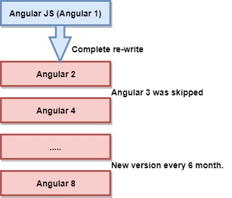</center>
      

* First AngularJS is created  But it contains many disadvantages ( So it is omitted )

* And later Angular2 is rewritted.It is completely different from angularJS. ( Wirks well)

* Later lot of angular versions came to play with slight changes in small,increamental,compatiable 
  changes in library files.After that , every six months , angular was updated with this small changes.But
  nothing to worry about the versions , we can even program easily eith any version of angular as the coding
  most likely similar to all.

<center>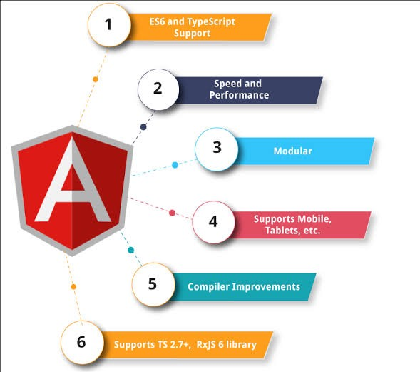</center>

## Video : 3 Project setup ##

### PreRequests for angular projects ###

* Nodejs --> It is used to bundle and optimize(Rearrange) the project.

* npm    --> It is Node Package Manager.
         --> It is used to manage different dependencies(particular order that must be followed to a process).
        
### Commands to check the node and npm versions in your device ###  

```javascript
node -v
```
* Sample Output may look like below:

```javascript
npm -v
```


<b style="color:red"> NOTE : Install the node and npm in device to process the angular </b>

## Step by Step procedures to start a angular project ##

### Step : 1 Install angular cli by followinf command in terminal. ###

```javascript
npm install -g @angular/cli
```
OR

```javascript
npm install -g @angular/cli@latest
```
### Step : 2  To check angular version. ###

```javascript
ng version
```
* The sample screen may look like below:


### Step : 3 Go to the directory to create a project ###

### Step : 4 Command to generate the new project ###

```javascript
ng new project_name
```
* It will ask for strictness , routing initially give NO to them.
* Just choose the styles which you want.

* Sample Screen when project has been generated in your machine.

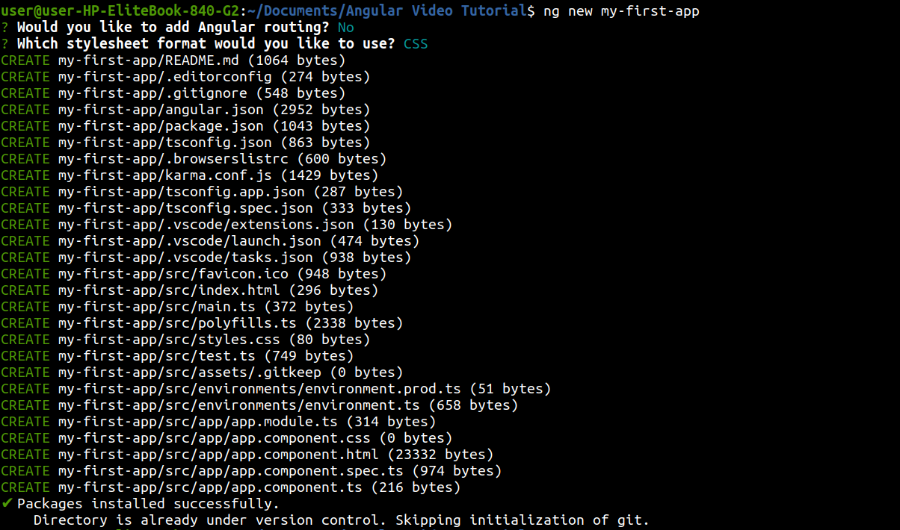

### Step : 5 Verify wheather it is successfully installed or not ###

### Step : 6 Go to the project directory by below command ###

```javascript
cd project_name
```
### Step : 7 To serve the application in local host ###

```javascript
ng serve
```
OR

```javascript
ng serve -o
```
OR

```javascript
ng s -o
```


 * Output screen in localhost:4200 :

 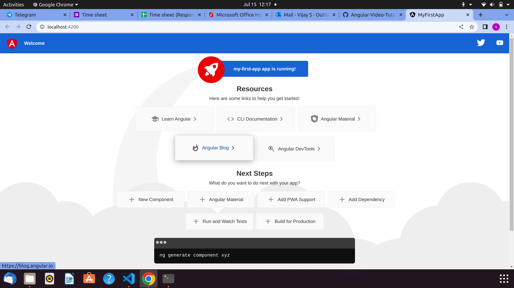

# Video : 5 Editing the first-app #

Before going to develope an application , we must aware of the installed files when we generated the new project using angular cli.

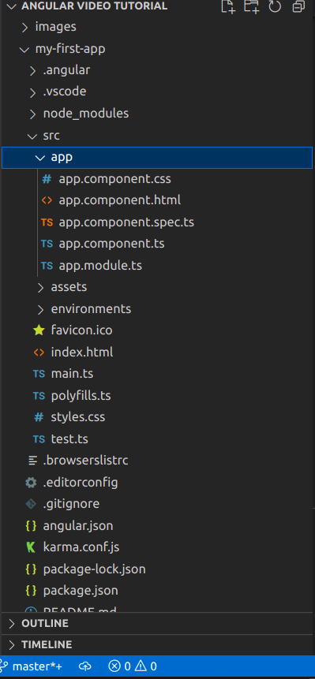

Let's have look on important files in the project and work on it.

* package.JSON file --> It contains every dependencies and dev-dependencies of our project.

* e2e --> It is end to end testing (Need Not to worry about it).     

* node_modules --> It contains all the dependencies that package.JSON have.

* src file --> It contains the bunch of our configurartions (Need Not to worry about it). 

* app file  --> Inside the src , app folder contains the five files as 

   * app.component.html --> It contains the page.

   * app.component.css  --> Style the html.

   * app.component.TS  --> It helps to interact with html for delevering data.

   * app.component.specs.ts --> It is for testing (It is not required).

* app.component.TS --> It is most important file in the application.It contains the app-root selector which is 
                       part of index.html.

                   --> We can add multiple components using the app.component.TS to link many html pages.

* Index.html   --> It is the root file of our application.It only first geneartes the 
                   application. We can see it in INSPECT (browser dev tools)        

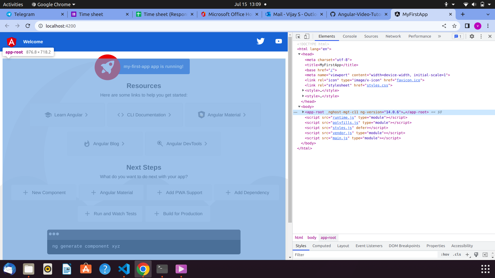   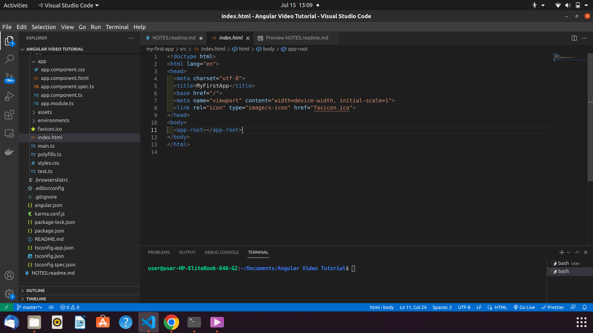                           

## EX : ##

## Simple editing with html and ts file with input field  ##

* Let's have a input field with simple type="text" and a para text.

* Then we should make it dynamicly change the content of the paragraph according to the input.

* We can achieve this by using the [(ngModule)]="variable_name" in angular.

### ngModel directive ###

* It is tool of angular FormsModule or directive which is used to store anything that type in the input field in  the provided variable name.

* The ngmodel directive binds the value of HTML controls (input, select, textarea) to application data. 

### Syntax ###

```javascript
[(ngModel)]="variable_name"
```
* It uses two way binding and we can learn what they are in further video.

### Requirements to use ngModel ###

* To utilize the ngModel directive , We must import the FormsModule from library in app.module.ts file.

* app.component.html
```javascript
<input type="text" [(ngModel)]="title">
<p > {{ title }} </p>
```

* app.component.ts
```javascript
import { Component } from '@angular/core';

@Component({
  selector: 'app-root',
  templateUrl: './app.component.html',
  styleUrls: ['./app.component.css']
})
export class AppComponent {
  title = 'vijay';
}

```

* app.module.ts
```javascript
import { NgModule } from '@angular/core';
import { BrowserModule } from '@angular/platform-browser';
import { FormsModule } from '@angular/forms';
import { AppComponent } from './app.component';

@NgModule({
  declarations: [
    AppComponent
  ],
  imports: [
    BrowserModule,
    FormsModule
  ],
  providers: [],
  bootstrap: [AppComponent]
})
export class AppModule { }

```

* Otherwise , It will show error.

### Here you can see the output ###
<video controls>
 <source src="videos/ngModel-output.webm" type="video/webm">
</video>

## video : 6 Type Script ##

* TypeScript is the another type of javascript which allows to define types of variables.

* Angular code should be wriiten in typescript.

* To learn angular , we don't want to learn typescript it will be understandable.

* Typescript does not run in browser , So it is converted to javascript and it is carried out by angular cli.
  And this process is very fast.

## video : 7 A project setup to add bootstrap styling ##

### Step : 1 Install the bootsrap file in project (locally) by following command ###

* Go to the project directory (make sure that you are in correct project directory) and type below command.

```javascript
npm install --save bootstrap
```
* Below is the Output Screen :

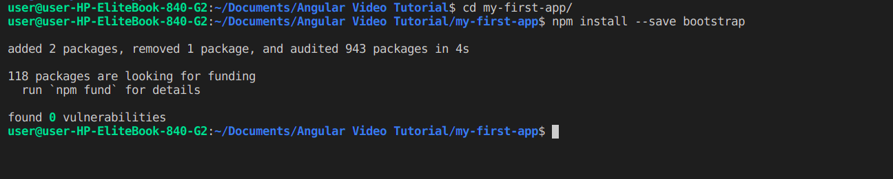

### <div style="color:red">NOTE : It wll install the bootstrap file in the node_modules folder of our application </div> ###

### Step : 2 Configure the new file in the angular.JSON file in application ###

* First of all , we have successfully installed the bootstrap styling file in our application.

* We can find it in node_modules -> bootstrap -> dist -> css -> bootstrap.min.css

* To use the imported file , we need to configure the file in angular.JSON file as below styles to overcome older style ( Append the imported in top )


### Step : 3 Rerun the server to bundle the package ###

* Save angular.json and other files and again use ng serve command to rerun .

### Step : 4 Verify the availability of bootstrap in browser ###

* Go to the localHost in the browser and check in the inspecrt page sources wheather the style.css contains the bootsrap vetrsion . If it is , everythiong worked  fine .

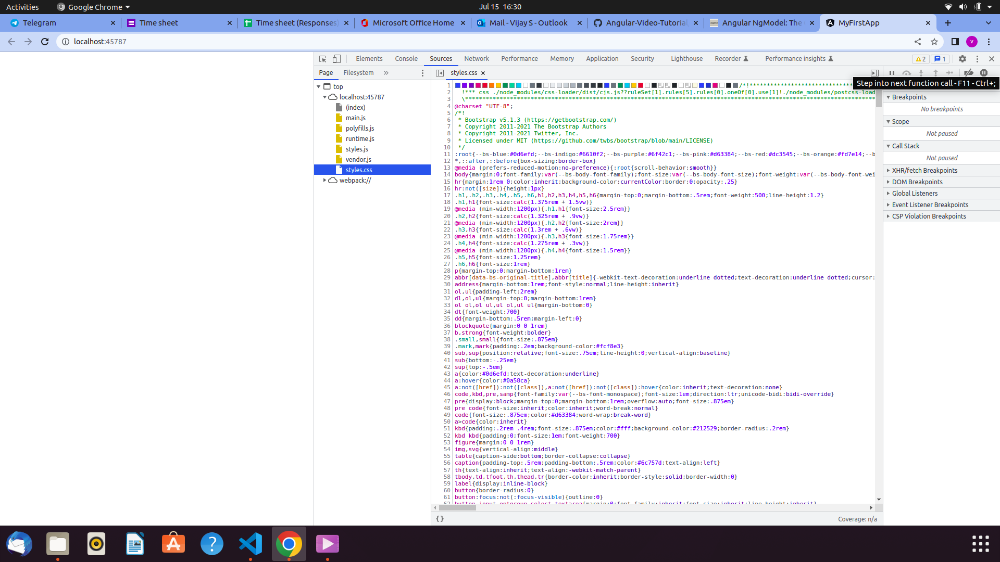

## video : 8 Angular app get loading and starting ##

* Atfirst , every angular application is getting started with the main.ts file . In main.ts file , The app.module.ts file is connected by the bootstrap.

```javascript

platformBrowserDynamic().bootstrapModule(AppModule)
  .catch(err => console.error(err));

```

* It will go for app.module.ts file. In app.module.ts file , it has been provided to the components

```javascript
@NgModule({
  declarations: [
    AppComponent
  ],
  imports: [
    BrowserModule
  ],
  providers: [],
  bootstrap: [AppComponent]
```
* In will visit the app.component.ts file for the first ,  It will have the selector to 'app-root' and templateurl as 'app.component.html'.The app.componen.html is the screen we see in browser contents.

```javascript

@Component({
  selector: 'app-root',
  templateUrl: './app.component.html',
  styleUrls: ['./app.component.css']
})

```
* Then the selector was called in index.html as <app-root></app-root> in the body.

```javascript
<!doctype html>
<html lang="en">
<head>
  <meta charset="utf-8">
  <title>MyFirstApp</title>
  <base href="/">
  <meta name="viewport" content="width=device-width, initial-scale=1">
  <link rel="icon" type="image/x-icon" href="favicon.ico">
</head>
<body>
  <app-root></app-root>
</body>
</html>

```

* This is the HTML page that we could see in the browser developement tool (inspect).

* NOTE: It will also contains the javascript bundles run the angular application.


# Section : 2 The Basics  #

## Video : 1 Components ##

* Components are the key feature of angular (i.e) We can build our whole application with multiple components.

* Each component will have it's own :
    
    * HTML file.
    * Styles file.
    * Ts file ( Contains its own business logic ).

* Componets are reusable ( Design , Styles , logics ).

* It is is used to splinting up into many parts of our complete application.

## Video : 2 Creating new componets mannually ##

### app component ###

* Before going to other components we must aware about appComponet which is root component.

* appComponents will also have html.styles,specs and ts file with that.

* The speciality is , the appComponent is one which has been provided in the bootstrap[] in app.module.ts which reprents that the app component is the one holds project.

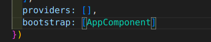

* We don't want to add other components in index.html.

* We just need other components in the app.components.html itself.

* The only selector which is added in the index.html is appComponent as below :

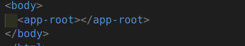

### Very basic component features ###

* When we say component , the .ts file is the building block . So the xxx.component.ts is the first thing , we should concern.

* We have to do all operations in the app folder . SO we must create our compinents inside the app folder with ifferent names .

* As we are going to understand only the simple features in components , we can create an seperate folder inside the app folder .

* In the Demo component , we should create an file with extension .TS with proper naming.

* Every component.ts file must contatin the following data 

```javascript

import { Component } from "@angular/core";

@Component({
 selector : 'app-demo',
 template : './demp.component.html'
}
)


export class DemoComponent{

}

```

* 1) --> class

     --> class is the maditory field in an component throughwhich the functionality of an component is decided ( business logic )

     --> We must export the class with export keyword before that , inorder to import it anyother file or component.

     --> class name should be meaningfull , first part should contain name and second part should 
         contatin description.

           Demo is the name and Component is the description.  ( DemoComponent ) .

* 2 ) --> Decorator 
 
      --> Decorator is the typescript feature which enhances the class or other elements .

      --> Decorator always starts with @ symbol.

      --> Decorator need to configured by passing javascript objects to it. Here are the most basic two configurartions.

        1 ) --> Selector 

            --> selector should be in staring .

            --> It contains the name to utilize the component in another component .

            --> The selector name should be unique.

        2 ) -->  Templateurl 

            --> This is the reference to the another file which contains the template html of our .ts file.

            --> This html file must be created with the same folder with .html extension.

* 3 ) --> import component .

      --> To use the component decorator , we must import it from angular/core library file.


## Video : 3 Understanding the role of appModueles ##

* app.module is the very important to any angular project which is like the parent of a family.

## Modules ##

* Modules are used to bundles the different spieces( components ) of any application into packeges.

## Very basic things in module ##


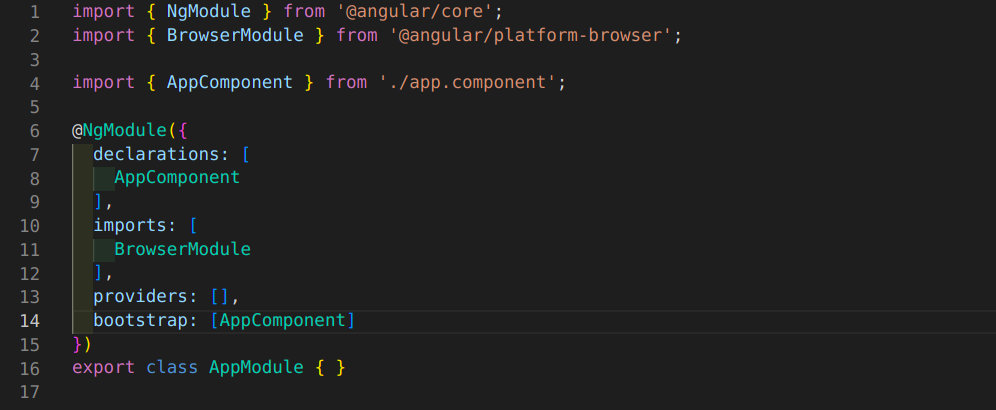


* Here , we can identify the following features in module.

* 1 ) --> An empty typescript class with export ( Same as Component )

* 2 ) --> Decorator : 

      --> Module decorator consists of @NgModule keyword in the beginning and it must be imported from 
          angular/core library file.

      --> Specially app.module.ts contains four basic properties and values as it's javascript object format 
          similar to component.

* 3 ) --> Decorator partitions :

      --> 1) bootstrap :

          --> It is responsible for angular to execute the first component when the app get started which
              is appcomponent.    

      --> 2 ) Declarations : 

          --> In declarations section , we must add the compoents that we created.

          --> The angular does not know the existance of component . So we need to update the every
              components presence in module.ts to get results.

          --> Once we added the component in declaration , it will ask to import the component from the 
              specified  path we should import it.

      --> 3 ) imports :

          --> Imports section allow us to import the other modules.

       --> 4 ) providers :

          --> It is used for services.

* Adding the democomponet in app.module.ts to make it use in project: 


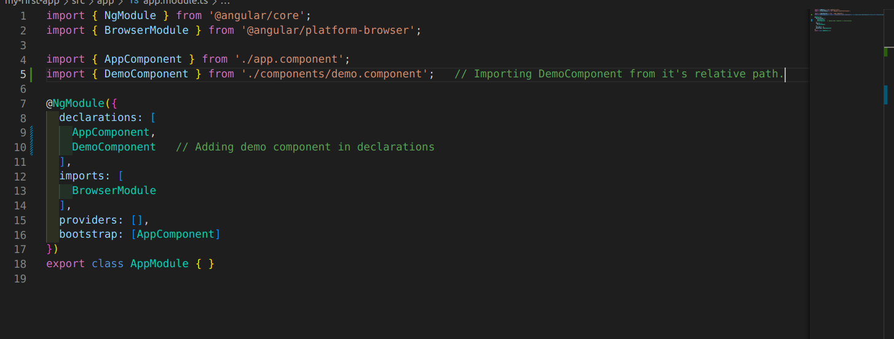

## video 4 : Using custom component ##

* We can create custom components according to our need . 

* Component can be also updated in the app.module.ts file.

* But , we can not see it in the bowser.

* For example : I have created a component named demo with simple .ts and .html which contains only simple text.

* .html

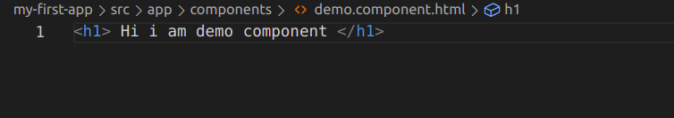

* .ts 


* Also i attached the component in app.module.ts succssfully as below:


* But , we can't see this in browser . As we know , the angular flow will be start from index.html . In index.html ,
only the root ( app module ) is connected .

* In the app.component.html only contains the simple text . To link our new custom component in app , we must add our new component in app.component.html as an element.

* To do so , we should use the selector of our custom component and utilize it in app.component.html as weee require.

* For Example , I have used the selector of demoComponent in app.component.html as this.

* app.component.html:

```javascript

<h1>Hi i am vijay's app componet</h1>
<app-demo></app-demo>

```

* democomponent.ts

```javascript

import { Component } from "@angular/core";

@Component({
 selector : 'app-demo',
 templateUrl : 'demo.component.html'
}
)


export class DemoComponent{

}

```
* Output :

* Before using selctor as element in app.component.html:
<br>

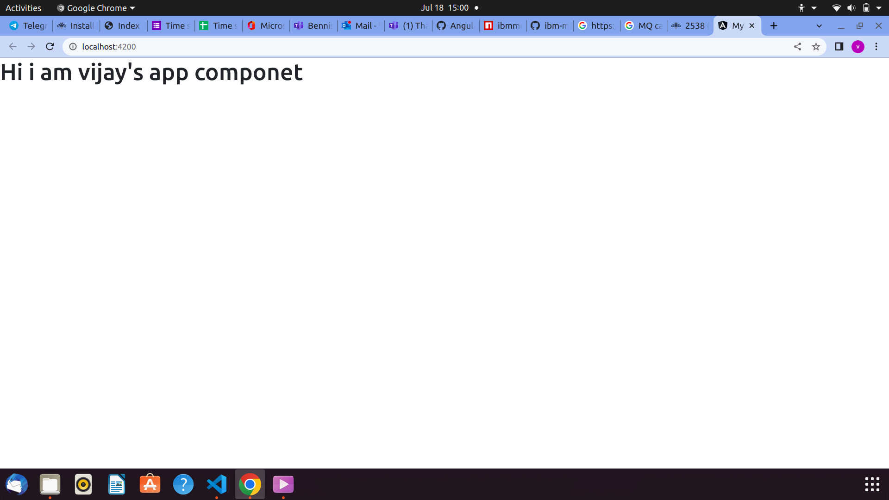

* After using selector as element in app.component.html :

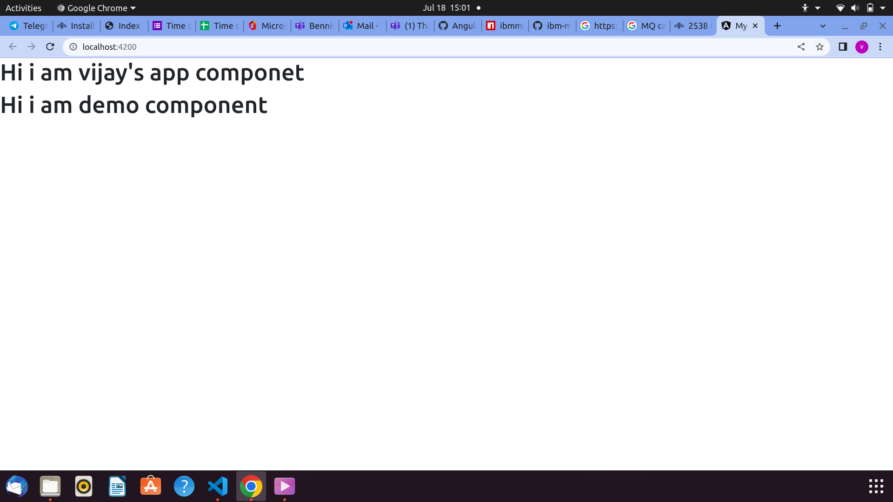


## Video : 5 Creating component with cli and nesting components ##

* We can create components with angular cli command :

```javascript

ng generate component component-name

```
* The shortcut of this command is :

```javascript

ng g c component-name

```

* These angular/cli command create a new folder in app folder with the 1 .html ,1 .style ,1 .spec and 1 .ts file with basic templates.

* We need to update the existence of new component in app.module.ts

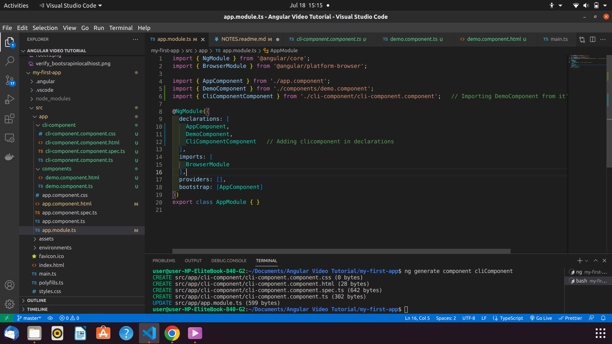

## Nesting component ##

* Nesting means , using one component within other using the selector as element in the .html.

* Angular allows repeat the components in same or different components .

* app.component.html :

```javascript
<h1>Hi i am vijay's app componet</h1>
<app-demo></app-demo>
<app-cli-component></app-cli-component>
```

* cli.component.html : 

```javascript

<p>I am cli-component </p>
<app-demo></app-demo>

```

## video : 6 Working with component Templates ##

* A component contains not only three properies such as selector ,TemplateUrl and Stylesurl but these are all the basics,

* Template is one of the most significant component decorartor property which allows internal html elements instaed connects the different .html file .

* template is used to do inline template if it very simple . It is string type .

* If code exists single element then we can use  ` ` { Back tick } symbol to denote the string as we do javascript.

```javascript

@Component({
 selector : 'app-demo',
 template : '<app-cli-component></app-cli-component>'  //here it is not link . it is used as element 
}
)

```


```javascript
@Component({
 selector : 'app-demo',
 template : 
 `<app-cli-component></app-cli-component>   
 <app-cli-component></app-cli-component>`    //multiple lines
}
)
```
```javascript

@Component({
 selector : 'app-demo',
 template : 
`<h1> Hello everyone in ...<h1>`
}
)
```
## Video : 7 Working with component styles ##

* styles is the another inportant component decorator which helps to inline styling ,

* It is basically an array . So that we can add more than one style or inline styles .

* In array , we should declare the ` ` { Back tick } to get results .

* It is just inline styling nothing different .

* It is slight differnt from styleUrl . styleUrl requires the seperate stylesheets to style but it is inline styling.
  But , both are array format.

```javascript

@Component({
  selector: 'app-root',
  templateUrl: './app.component.html',
  // styleUrls: ['./app.component.css'],
  styles : [
`
.h1{
  color:blue;       
}
`                 //  Using inlie styles
]
})

```

## Video : 8 Full understanding of component selector ##

* selector is the main component decorator property to understand .

* It is the source to connect the components .

* Basically , a selector acts like CSS selector which only uses the element name to style .

### Normal method ###

app.component.html

```javascript
<div class="container">
    <div class="row">
     <div class="clo-xs-12">
        <h1 class="h1">Hi i am vijay's app componet</h1>
        <hr>
        <app-demo></app-demo>     <!-- It is look like an HTML element -->
        <app-cli-component></app-cli-component> 
     </div>
    </div>
</div>
```

demo.component.ts file :

```javascript
import { Component } from "@angular/core";

@Component({
 selector : 'app-demo',   // Here we selected the element by it's name as we do in CSS
 templateUrl : 'demo.component.html'
}
)


export class DemoComponent{

}
```

### Attribute method  ###

* We can also use other method to utilize this selector which means attribute selector as follows :

* app.component.html :

```javascript
<div class="container">
    <div class="row">
     <div class="clo-xs-12">
        <h1 class="h1">Hi i am vijay's app componet</h1>
        <hr>
        <app-demo></app-demo>     <!-- It is look like an HTML element -->
        <div app-cli></div>      <!-- We can select it by attribute name in .ts file -->
      </div>
    </div>
</div>
```

* Using the attribute name in .ts file with [] notation :

```javascript
import { Component, OnInit } from '@angular/core';

@Component({
  // selector: 'app-cli-component',
  selector : '[app-cli]',     // Using the attribute name as selector by [] notation
  templateUrl: './cli-component.component.html',
  styleUrls: ['./cli-component.component.css']
})
export class CliComponentComponent implements OnInit {

  constructor() { }

  ngOnInit(): void {
  }

}
```

### class method ###

* We can also use the notation in .ts file as selector by using the element with class.

* app.component.html file :

```javascript
<div class="container">
    <div class="row">
     <div class="clo-xs-12">
        <h1 class="h1">Hi i am vijay's app componet</h1>
        <hr>
        <app-demo></app-demo>     <!-- It is look like an HTML element -->
        <div app-cli></div>      <!-- We can select it by attribute name in .ts file -->
        <div class="app-cli"><div>  <!-- We can select by the class name in .ts file -->
      </div>
    </div>
</div>
```

* .ts file :

```javascript
import { Component, OnInit } from '@angular/core';

@Component({
  // selector: 'app-cli-component',
  // selector : '[app-cli]',     // Using the attribute name as selector by [] notation
  selector : '.app-cli',     // Using the class name with . notation .
  templateUrl: './cli-component.component.html',
  styleUrls: ['./cli-component.component.css']
})
export class CliComponentComponent implements OnInit {

  constructor() { }

  ngOnInit(): void {
  }

}
```

### NOTE ###

* We cannot access selectors with id .

* We cannot access the selectors by pseudo selectors like :hover or etc .

## Video : 9 Data Binding ##

* Data-Binding is the communication between the Typescript code ( Business Logic ) and the Template ( HTML ) in a component.

* The template is only visible to user ( HTML ) . Inorder to show the data dynamically , data-binding came to play to connect the typescript and template ( HTML ).

* There are some type of data-bindings available as below :

### One way Data-binding ###

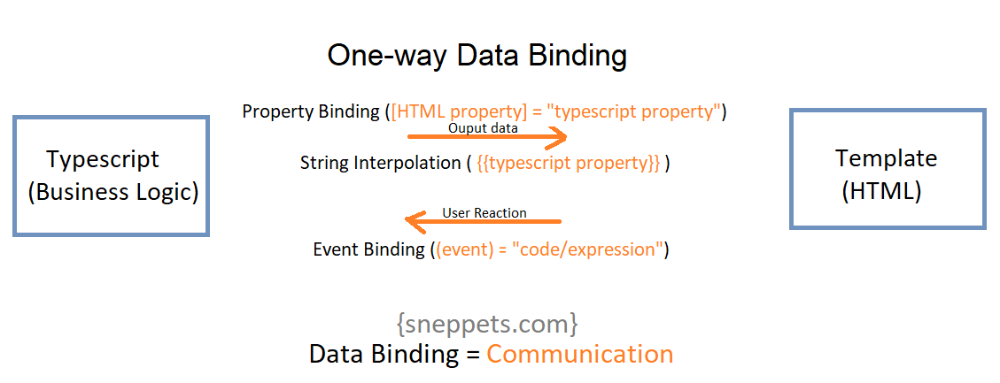

### Two-way Data-binding ###

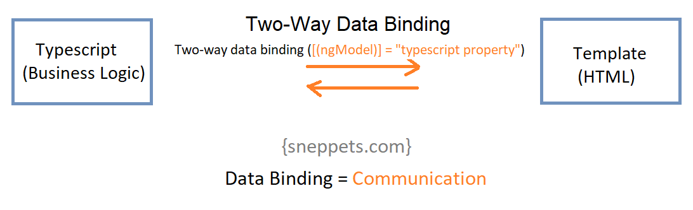

## Video : 10 String Interpolation ##

* String interpolation is the simple data-binding which is used to pass the data dynamically from typescript to template ( HTML ).

* In string interpolation , all data are converted to strinng in the end .

* It uses the syntax <b style="color:blue">  {{ Typescript variable name OR Property name  }} </b>

* We cannot use the multiline expressions in the {{ }} syntax .

## Example : ##

* .html file :

```javascript
<h3> Data Binding </h3>

<h4> String interpolation </h4>

<p> I am going to explain data-binding type : {{ type }} which is {{ name }} </p>

<p> {{ getStringInterpolation() }}</p>
```

* .ts file :

```javascript
import { Component, OnInit } from '@angular/core';

@Component({
  selector: 'app-data-binding',
  templateUrl: './data-binding.component.html',
  styleUrls: ['./data-binding.component.css']
})
export class DataBindingComponent implements OnInit {
  type: number = 1;
  name: string = "string interpolation";

  getStringInterpolation(){
    return "I am the string interpolation method who binds the method to html template from typescript";
  }
constructor() { }

  ngOnInit(): void {}

}

```

* OUTPUT:

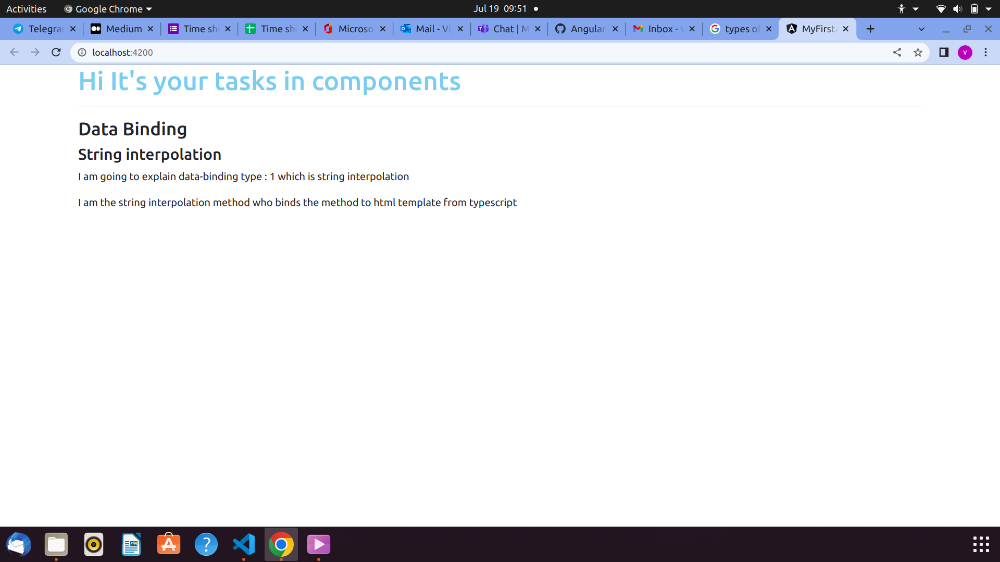

## Video : 11 Property Binding ##

* Property binding is used to connect the attributes of an HTML element to the typescript file ( .TS file ).

* The property-binding method changes the DOM { Document Object Model } of the specified html element.

* We can bind the attributes of our html element by with the following syntax :

* <b> [ Varible or name property name to bind ]   </b>

## Example : ##

* Now , we take a button element with the attribute disabled earlier.

* Inorder to change the disabled  attribute with dynamic data from typescript , we must bind the attribute with [] symbol.

* So , We can change the disabled attribute variale value to "true" to make it enable with typescript .

* .html ( disabled property is binded with the variable status )

```javascript
<button
 class="btn btn-success"
 [disabled]="status"  
> Disable me </button>
```
* .ts file ( Here we set variable true initially to keep it disable . After 1000 milliseconds we make the variabke to false to enable)

```javascript
import { Component, OnInit } from '@angular/core';

@Component({
  selector: 'app-data-binding',
  templateUrl: './data-binding.component.html',
  styleUrls: ['./data-binding.component.css']
})
export class DataBindingComponent implements OnInit {
  type: number = 1;
  name: string = "string interpolation";
  status: boolean =true; 

  getStringInterpolation(){
    return "I am the string interpolation method who binds the method to html template from typescript";
  }
constructor() { 
  setTimeout(()=>{
     this.status=false;
  },1000)
}

  ngOnInit(): void {}

}
```

## Video : 12 Property binding VS String interpolation ##

* When we want to output somethong dynamically from template we must use "String-interpolation" and If we want to change the DOM content of an element , we must go for "Property binding".

* But , We cannot use both the property-binding and string-interpolation together.

## Video : 13 Event binding ##

* Event binding is the process of adding some functionalities to the HTML elements when certain events occured as click,mouseover , onkeypress , etc.

* These events shoul be binded with the HTMl element by  <b style="color:blue"> ( event name ) = " method name () "  </b>

* The method we assigned is need to be described the functionality to a event occured in the template elements in Typescript file.

## Example : ##

* Let us assign a button to a click event with some method which can change the button color text .

* .HTML file :

```javascript

<button 
class="btn btn-warning"
(click)="changeColor()"
>
Button 
</button>
<p> My color is {{ color }} </p>
```

.Ts file :

```javascript
  color:string ="red";

  changeColor(){
    this.color="blue";
   }

```
## VIdeo : 14 Passing and using Data with Event binding ( $event ) ##

* Event binding is very important in binding . In this we can get the information on several events with the help of $event.

* By passing the $event as as argument to event in HTML . We can get the possible events available by console it in the method.

* After that we can choose our event according to our need .


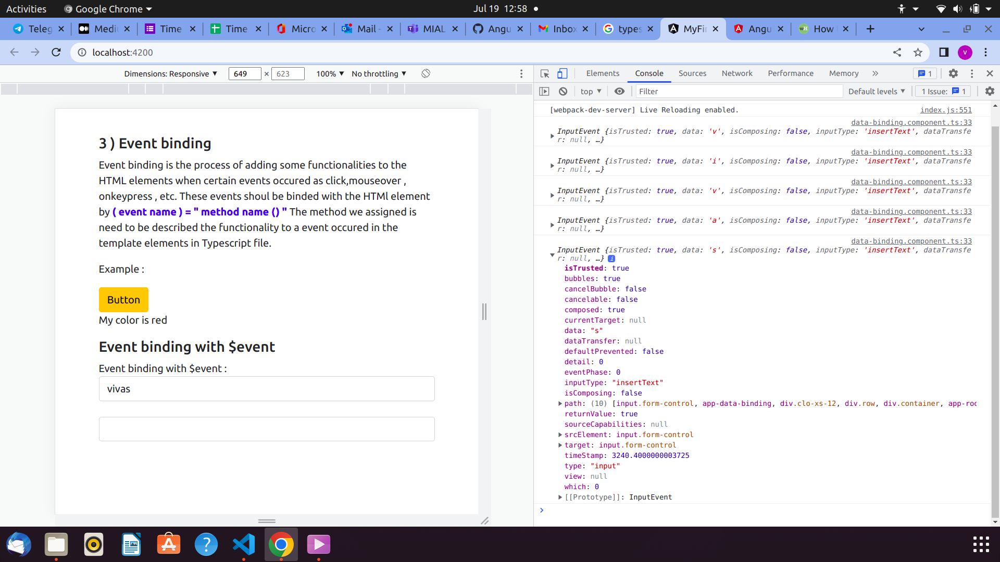


## Example : ##

* We can take the values to display in the paragraph from the events .

* Let us write the event like below:

```javascript
  para :string ='';
onShow( event : any ){
   this.para = (<HTMLInputElement>event.target).value;   // To access the correct value from the DOM.
}
```
* We can bind the event with the HTML like below :

```javascript
<input
type="text"
class="form-control"
(input)="onShow($event)"
/>
<p> {{ para }}</p>
```

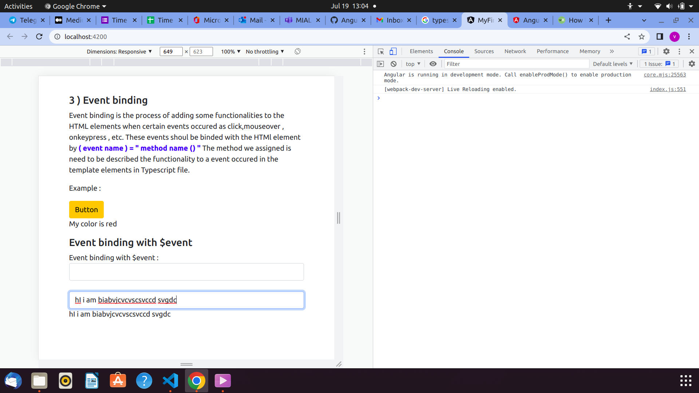


## Video : 15 Two-way databinding ##

* Two-way data binding is the process of binding the value from both ends with the help of directives.

* We must use the ([ ])=" property name " --> to two way binding.

* It is simply like getting data from user and stores in a variable and utilize it for furthuer references.

* ngModel --> The one of the most frequently used directive in formsModule.

* We should have imported the FormsModule from angular form in the imports section and app.module.ts file.

* .html 

``Javascript
<input 
type="text"
class="form-control"
[(ngModel)]="content"
/>

<p>{{ content }}</p>
```

* .ts file :

```javascript
content ='vijay';
```

## Video : 16 Combining all forms of data-binding ##

* Here we can set an assignment to us .

* We must create an input field and a button.

* By clicking button the value which is obtained from the input filed must be displayed and the button must be enable only a 2 seconds when the page gets loaded.

## Video : 17 Directives ##

* Directives are Instructions in the DOM ( Document Object Model ).

* EXAMPLE :

  * components --> Components are also directives with templates which tells the component to locate in particular place .

* ngIF and more and more...

## Video : 18 Using ngIf to output data conditionally ##

* *ngIf is the directive which acts like a normal if class .

* It is structural directive which structures the DOM .

* It should be used in elements attribute with an expression / variable / method that should return either true or false.

* According to the value it determines wheather the element need to be displayed or not.

* For example , ` <p *ngIf="false"> It will not show </p> `

## Video : 19 Enhancing ngIf with an else condition ##

* The else condition can be implemented if the value returns false in the angular element attribute.

* To achieve this , we could make use of locators in html <ng-template> < #locatorName ></> </ng-template>

* This portion will be displayed if the given condition is not satisfied.

```javascript

<p> Your name is :<span *ngIf="select; else notClicked"> {{ yourName }}     </span>
</p>

<ng-template #notClicked>
<p>Button is not clicked </p>
</ng-template>
```

```javascript
import { Component, OnInit } from '@angular/core';

@Component({
  selector: 'app-directives',
  templateUrl: './directives.component.html',
  styleUrls: ['./directives.component.css']
})
export class DirectivesComponent implements OnInit {

  yourName:String='';
  select=false;

  display(){
    this.select=true;
  }

  constructor() { }

  ngOnInit(): void {
   
    
  }

}

```